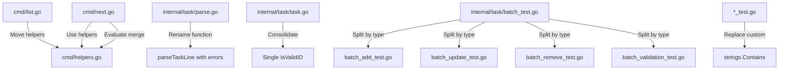

# Code Quality Improvements Design

## Overview

This design document outlines the implementation approach for improving code quality in the rune codebase through five key refactoring efforts: consolidating shared helper functions, removing custom standard library reimplementations, improving function naming consistency, simplifying redundant validation functions, and reorganizing oversized test files. All changes are internal refactorings that maintain identical CLI behavior and output.

### Goals
- Reduce code duplication and improve maintainability
- Follow Go idioms and best practices
- Improve test organization for better navigation
- Maintain 100% backwards compatibility for CLI output
- Preserve or improve current test coverage (70-80%)

### Non-Goals
- Performance optimization
- New features or functionality
- Changes to public APIs or CLI interfaces
- Refactoring well-organized test files under 1000 lines

## Architecture

### High-Level Changes



## Components and Interfaces

### 1. Helper Functions Consolidation

**Current State:**
- `formatStatus()` in `cmd/list.go` (lines 150-161)
- `getTaskLevel()` in `cmd/list.go` (lines 163-174)
- `countAllTasks()` in `cmd/list.go` (lines 196-202)
- `formatStatusMarkdown()` in `cmd/next.go` (lines 561-572)

**New Structure:**

#### cmd/helpers.go
```go
package cmd

import "github.com/arjenschwarz/rune/internal/task"

// Checkbox markers for markdown status formatting
const (
	checkboxPending    = "[ ]"
	checkboxInProgress = "[-]"
	checkboxCompleted  = "[x]"
)

// formatStatus converts a task.Status to a human-readable string
func formatStatus(status task.Status) string {
    switch status {
    case task.Pending:
        return "Pending"
    case task.InProgress:
        return "In Progress"
    case task.Completed:
        return "Completed"
    default:
        return "Unknown"
    }
}

// formatStatusMarkdown converts a task.Status to markdown checkbox format
// Decision: Keep separate from formatStatus as they serve different purposes
// (human-readable vs markdown rendering)
func formatStatusMarkdown(status task.Status) string {
    switch status {
    case task.Pending:
        return "[ ]"
    case task.InProgress:
        return "[-]"
    case task.Completed:
        return "[x]"
    default:
        return "[ ]"
    }
}

// getTaskLevel calculates the nesting level from a hierarchical task ID
// Example: "1" = 1, "1.2" = 2, "1.2.3" = 3
func getTaskLevel(id string) int {
    if id == "" {
        return 0
    }
    level := 0
    for _, char := range id {
        if char == '.' {
            level++
        }
    }
    return level + 1
}

// countAllTasks recursively counts all tasks including children
func countAllTasks(tasks []task.Task) int {
    count := len(tasks)
    for _, t := range tasks {
        count += countAllTasks(t.Children)
    }
    return count
}
```

**Decision: Keep formatStatus and formatStatusMarkdown separate**

**Rationale:**
- While they convert the same enum, they serve different output contexts
- formatStatus: human-readable strings for table/JSON display
- formatStatusMarkdown: checkbox symbols for markdown rendering
- Keeping separate maintains clarity of intent at call sites
- No benefit to combining - a format parameter adds complexity without improving readability
- The critic's suggestion of `formatStatus(status, markdown bool)` would make every call site check "is this for markdown?" which is less clear than having two appropriately-named functions

**Additional Helper to Consider:**
- `findDuplicatePhases()` at `cmd/list.go:205-220` - phase-specific utility used only in list command

**Decision:** Do NOT move `findDuplicatePhases` to helpers.go because:
- Only used in one command (list.go)
- Phase-specific logic, not a general utility
- Moving would not improve reusability
- Follows the principle: only move functions that ARE or WILL BE used in multiple places

**Usage Update Pattern:**
```go
// In cmd/list.go and cmd/next.go
// Before:
status := formatStatus(task.Status)

// After: (no change to calling code, just remove local definition)
status := formatStatus(task.Status)
```

#### cmd/helpers_test.go
```go
package cmd

import (
    "testing"
    "github.com/arjenschwarz/rune/internal/task"
)

func TestFormatStatus(t *testing.T) {
    tests := map[string]struct {
        status task.Status
        want   string
    }{
        "pending":     {task.Pending, "Pending"},
        "in_progress": {task.InProgress, "In Progress"},
        "completed":   {task.Completed, "Completed"},
    }

    for name, tc := range tests {
        t.Run(name, func(t *testing.T) {
            got := formatStatus(tc.status)
            if got != tc.want {
                t.Errorf("formatStatus(%v) = %q, want %q", tc.status, got, tc.want)
            }
        })
    }
}

// Similar tests for formatStatusMarkdown, getTaskLevel, countAllTasks
```

### 2. Remove Custom String Contains

**Current Locations:**
- `internal/task/autocomplete_test.go:344-356` - `containsString()` and `stringContains()` functions
- `cmd/integration_test.go:1070` - `containsString()` function (confirmed: 108 usages in this file)

**Change Pattern:**
```go
// Before:
if containsString(output, "expected text") {
    // ...
}

// After:
if strings.Contains(output, "expected text") {
    // ...
}
```

**Files to Update:**
1. Remove `containsString()` and `stringContains()` function definitions
2. Update all call sites to use `strings.Contains()`
3. Verify `strings` package is imported

### 3. Parse Function Naming Improvement

**Current State:**
- `parseTaskLineWithError(line string) (Task, bool, error)` at line 286
- `parseTaskLine(line string) (Task, bool)` at line 334 (wraps above, discards error)

**Call Site Analysis:**
1. Line 155: `parseTasksAtLevel` ALREADY uses `parseTaskLineWithError` with full error handling
2. Line 255: Uses `parseTaskLine` (discards errors) in `parseDetailsAndChildren`
3. Line 417: Uses `parseTaskLine` (discards errors) in `ExtractPhaseMarkers`

**Key Insight:** The error-discarding version is used in contexts where parse errors are NOT critical:
- Line 255: Checking if a line might be a task (in detail parsing context)
- Line 417: Extracting phase markers where malformed tasks don't matter

**New Structure:**
```go
// Rename parseTaskLineWithError to parseTaskLine
func parseTaskLine(line string) (Task, bool, error) {
    trimmed := strings.TrimSpace(line)

    // Check if it looks like a task but with invalid status
    if strings.HasPrefix(trimmed, "- [") && strings.Contains(trimmed, "]") {
        // ... validation logic ...
        return Task{
            Title:  matches[4],
            Status: status,
        }, true, nil
    }

    // Not a task line at all
    return Task{}, false, nil
}
```

**Error Handling Strategy for Callers:**

**Line 155 (parseTasksAtLevel):** Already handles errors properly
```go
// NO CHANGE NEEDED - already calls parseTaskLineWithError
task, ok, err := parseTaskLineWithError(lines[i])
// Becomes:
task, ok, err := parseTaskLine(lines[i])
```

**Line 255 (parseDetailsAndChildren):** Parse errors should abort since we're building task structure
```go
// Before:
if _, ok := parseTaskLine(lines[i]); ok {
    // This is a subtask
    children, newIdx, err := parseTasksAtLevel(lines, i, expectedIndent, parentID, taskList)
    // ...
}

// After:
if _, ok, err := parseTaskLine(lines[i]); err != nil {
    return nil, i, fmt.Errorf("line %d: %w", i+1, err)
} else if ok {
    // This is a subtask
    children, newIdx, err := parseTasksAtLevel(lines, i, expectedIndent, parentID, taskList)
    // ...
}
```

**Line 417 (ExtractPhaseMarkers):** Parse errors can be safely ignored (just skip the line)
```go
// Before:
} else if _, ok := parseTaskLine(line); ok {
    // Extract task ID from the line
    // ...
}

// After:
} else if _, ok, err := parseTaskLine(line); err == nil && ok {
    // Extract task ID from the line
    // ...
}
```

**Rationale:** This approach maintains current behavior (phase extraction ignores malformed tasks) while exposing errors where they matter (task structure building)

### 4. ID Validation Simplification

**Current State:**
```go
// internal/task/task.go:138
func isValidID(id string) bool {
    return taskIDPattern.MatchString(id)
}

// internal/task/task.go:143
func IsValidID(id string) bool {
    return isValidID(id)
}
```

**Call Sites for isValidID (7 locations):**
- `internal/task/parse.go:374`
- `internal/task/task.go:126`
- `internal/task/task.go:131`
- `internal/task/task.go:144` (in IsValidID definition)
- `internal/task/batch.go:29`
- `internal/task/operations.go:73`
- `internal/task/operations.go:408`

**New Structure:**
```go
// Single implementation, public API
func IsValidID(id string) bool {
    return taskIDPattern.MatchString(id)
}
```

**Update Pattern:**
```go
// Before:
if !isValidID(t.ID) {
    return fmt.Errorf("invalid task ID format: %s", t.ID)
}

// After:
if !IsValidID(t.ID) {
    return fmt.Errorf("invalid task ID format: %s", t.ID)
}
```

### 5. Test File Reorganization

#### batch_test.go Split (2549 lines → ~600 lines each)

**Analysis of Test Function Groups (41 total):**

**Group 1: Addition Operations (11 functions) → batch_add_test.go**
- TestExecuteBatch_SingleAdd
- TestExecuteBatch_MultipleOperations (mixed, but starts with add)
- TestExecuteBatch_ComplexOperations (mixed)
- TestExecuteBatch_PositionInsertionSingle
- TestExecuteBatch_PositionInsertionHierarchical
- TestExecuteBatch_PositionInsertionValidation
- TestExecuteBatch_PositionInsertionMultiple
- TestExecuteBatch_PositionInsertionWithOtherOperations
- TestExecuteBatch_PositionInsertionAtomicFailure
- TestExecuteBatch_PositionInsertionDryRun
- TestExecuteBatch_AddWithRequirements

**Group 2: Update Operations (13 functions) → batch_update_test.go**
- TestExecuteBatch_UnifiedUpdateWithStatus
- TestExecuteBatch_UnifiedUpdateOperations
- TestExecuteBatch_UnifiedUpdateStatusOnly
- TestExecuteBatch_UnifiedUpdateTitleAndStatus
- TestExecuteBatch_UnifiedUpdateDetailsAndReferencesWithoutStatus
- TestExecuteBatch_UnifiedUpdateEmptyOperation
- TestExecuteBatch_UnifiedUpdateTitleLengthValidation
- TestExecuteBatch_UnifiedUpdateAutoCompleteTriggers
- TestExecuteBatch_UpdateStatusOperationInvalid
- TestExecuteBatch_UpdateWithRequirements
- TestExecuteBatch_AutoCompleteSimpleHierarchy
- TestExecuteBatch_AutoCompleteMultiLevel
- TestExecuteBatch_AutoCompletePartialCompletion

**Group 3: Validation & Error Handling (10 functions) → batch_validation_test.go**
- TestExecuteBatch_ValidationFailures
- TestExecuteBatch_AtomicFailure
- TestExecuteBatch_DryRun
- TestBatchRequest_JSONSerialization
- TestBatchResponse_JSONSerialization
- TestValidateOperation_EdgeCases
- TestExecuteBatch_RequirementsValidation
- TestExecuteBatch_AtomicBehaviorWithInvalidRequirements
- TestBatchRequest_RequirementsFile
- TestExecuteBatch_AutoCompleteErrorHandling

**Group 4: Complex & Mixed Operations (7 functions) → batch_operations_test.go**
- TestExecuteBatch_AutoCompleteWithMixedOperations
- TestExecuteBatch_AutoCompleteSameParentMultipleTimes
- TestExecuteBatch_AutoCompleteDryRun
- TestExecuteBatch_AutoCompleteComplexScenario
- TestExecuteBatch_PhaseAddOperation
- TestExecuteBatch_PhaseDuplicateHandling
- TestExecuteBatch_MixedPhaseOperations

**Shared Test Helpers Strategy:**

Create `batch_helpers_test.go` for shared test utilities:
```go
package task

// Helper functions that are used across multiple batch test files
// This file contains NO test functions, only helpers

// StatusPtr is used across all batch tests to create status pointers for operations
func StatusPtr(s Status) *Status {
    return &s
}

// Any other shared test setup/teardown functions
```

This approach:
- Keeps helpers accessible to all test files (same package)
- Clear naming indicates it's for test helpers, not actual tests
- Avoids duplication across split test files
- Go test runner will not treat this as a test file (no Test* functions)

#### parse_test.go Split (1175 lines → ~600 lines each)

**Test Function Groups (16 total):**

**Group 1: Basic Parsing (9 functions) → parse_basic_test.go**
- TestParseMarkdown
- TestParseFile
- TestParseTaskStatus
- TestParseDetailsAndReferences
- TestParseHierarchy
- TestParseMalformedContent
- TestParseComplexFile
- TestParseEdgeCases
- TestParsePerformance

**Group 2: Front Matter & Requirements (7 functions) → parse_frontmatter_test.go**
- TestParseRequirements
- TestParseMarkdownWithRequirements
- TestParseRequirementsRoundTrip
- TestParseRoundTrip
- TestParseMarkdownWithFrontMatter
- TestParseFileWithFrontMatter
- TestBackwardCompatibility

**Shared Test Helper Strategy:**

Create `parse_helpers_test.go`:
```go
package task

import "os"

// writeTestFile is used by both parse_basic_test.go and parse_frontmatter_test.go
func writeTestFile(path, content string) error {
    return os.WriteFile(path, []byte(content), 0644)
}
```

Alternative: Duplicate the small helper in both files (it's only 3 lines)

## Data Models

No changes to data models - all refactoring is internal to existing structures.

## Error Handling

### Parse Function Error Handling

**Current Behavior:**
- `parseTaskLineWithError` returns errors
- `parseTaskLine` silently discards errors
- Callers using `parseTaskLine` miss error conditions

**New Behavior:**
- Single `parseTaskLine` returns errors
- All callers must handle or propagate errors
- Better error visibility for malformed task lines

**Error Propagation Pattern:**
```go
// In parseTasksAtLevel and parseDetailsAndChildren
task, isTask, err := parseTaskLine(lines[i])
if err != nil {
    return nil, 0, fmt.Errorf("line %d: %w", i+1, err)
}
if isTask {
    // Process task
}
```

## Testing Strategy

### Unit Tests

**New Test Files:**
1. `cmd/helpers_test.go`
   - TestFormatStatus (3 cases: Pending, InProgress, Completed)
   - TestFormatStatusMarkdown (3 cases + default)
   - TestGetTaskLevel (5 cases: empty, "1", "1.2", "1.2.3", edge cases)
   - TestCountAllTasks (4 cases: empty, flat, nested, deep hierarchy)

**Updated Test Files:**
2. `internal/task/parse_test.go` → split into:
   - `parse_basic_test.go` (retain writeTestFile helper)
   - `parse_frontmatter_test.go` (may need to duplicate or import helper)

3. `internal/task/batch_test.go` → split into:
   - `batch_add_test.go`
   - `batch_update_test.go`
   - `batch_validation_test.go`
   - `batch_operations_test.go`
   - Keep shared helpers accessible (either in batch_test.go stub or duplicated)

**Modified Tests:**
4. `internal/task/autocomplete_test.go`
   - Remove custom string functions
   - Update to use strings.Contains()

5. `cmd/integration_test.go`
   - Remove any custom string functions
   - Update to use strings.Contains()

### Integration Testing

**Validation Approach:**
1. Run full integration test suite with `INTEGRATION=1 make test-integration`
2. Compare CLI output before/after for all example files
3. Verify identical behavior for:
   - `rune list`
   - `rune next`
   - `rune add`
   - `rune update`
   - `rune batch`
   - All other commands

**Output Validation Script:**
```bash
# Before refactoring
for example in examples/*.md; do
    rune list "$example" > /tmp/before-$(basename "$example").txt
done

# After refactoring
for example in examples/*.md; do
    rune list "$example" > /tmp/after-$(basename "$example").txt
done

# Compare
diff -r /tmp/before-* /tmp/after-*
```

### Coverage Verification

**Baseline:** 70-80% (current)

**Measurement:**
```bash
make test-coverage
```

**Expected Impact:**
- Helper functions: +4 new unit tests (increase coverage)
- Parse function: Existing tests maintained, error handling improved
- ID validation: No coverage change (same logic, different name)
- Test file splits: No coverage change (same tests, different files)
- String contains removal: No coverage change (same assertions)

## Implementation Plan

### Phase 1: Helper Functions Consolidation
1. Create `cmd/helpers.go` with all four functions
2. Create `cmd/helpers_test.go` with comprehensive tests
3. Update `cmd/list.go` - remove function definitions, keep usage
4. Update `cmd/next.go` - remove formatStatusMarkdown definition, keep usage
5. Run `make test` to verify
6. Run specific command tests to ensure behavior unchanged

### Phase 2: String Contains Replacement
1. Search all test files for `containsString` and `stringContains`
2. Update `internal/task/autocomplete_test.go`
   - Replace all usage with `strings.Contains()`
   - Remove function definitions
3. Update `cmd/integration_test.go` if needed
4. Run `make test` to verify

### Phase 3: Parse Function Refactoring
1. Rename `parseTaskLineWithError` to `parseTaskLine`
2. Update 3 call sites to handle errors:
   - Line 255: Add error handling
   - Line 334: Remove (function definition)
   - Line 417: Add error handling
3. Run `make test` to verify error handling
4. Check that parse errors are properly surfaced

### Phase 4: ID Validation Simplification
1. Update 7 call sites to use `IsValidID` instead of `isValidID`
2. Remove `isValidID` function
3. Run `make test` to verify

### Phase 5: Test File Splitting
1. Split `batch_test.go`:
   - Create batch_add_test.go (move 11 functions)
   - Create batch_update_test.go (move 13 functions)
   - Create batch_validation_test.go (move 10 functions)
   - Create batch_operations_test.go (move 7 functions)
   - Handle shared helpers (keep in batch_test.go or duplicate)
2. Split `parse_test.go`:
   - Create parse_basic_test.go (move 9 functions)
   - Create parse_frontmatter_test.go (move 7 functions)
   - Handle writeTestFile helper
3. Run `make test` to verify all tests pass
4. Verify each file is 800-1000 lines

### Phase 6: Final Validation
1. Run `make check` (fmt, lint, test)
2. Run `make test-integration` with INTEGRATION=1
3. Run `make modernize`
4. Compare CLI output for all example files
5. Verify test coverage with `make test-coverage`

## Rollback Plan

If any phase fails:
1. Revert the specific phase changes using git
2. Re-run validation to ensure system is stable
3. Analyze failure and adjust approach
4. Retry phase with fixes

Each phase is independent and can be rolled back without affecting others (except Phase 1 must complete before others use the helpers).

## Risks and Mitigations

### Risk 1: Missed Call Sites
**Mitigation:** Use grep/ripgrep to exhaustively search for function usage before refactoring

### Risk 2: Test Coverage Regression
**Mitigation:** Run coverage before/after each phase; block merge if coverage decreases

### Risk 3: Changed CLI Output
**Mitigation:** Script-based comparison of before/after output for all example files

### Risk 4: Import Cycles (helpers.go)
**Mitigation:** helpers.go is in cmd package (same as callers), so no cycle risk

### Risk 5: Test File Split Breaking Shared Helpers
**Mitigation:** Keep shared helpers in batch_test.go or duplicate as needed; Go allows multiple test files to share helpers in same package

## Success Criteria

1. ✅ All helper functions in `cmd/helpers.go` with tests
2. ✅ No custom string contains implementations remain
3. ✅ Single `parseTaskLine` function with proper error handling
4. ✅ Single `IsValidID` function (no redundant wrapper)
5. ✅ Test files organized in 800-1000 line chunks
6. ✅ All tests pass (`make test` and `make test-integration`)
7. ✅ Test coverage maintained at 70-80%
8. ✅ CLI output identical for all commands
9. ✅ Zero golangci-lint issues
10. ✅ `make modernize` produces no changes
