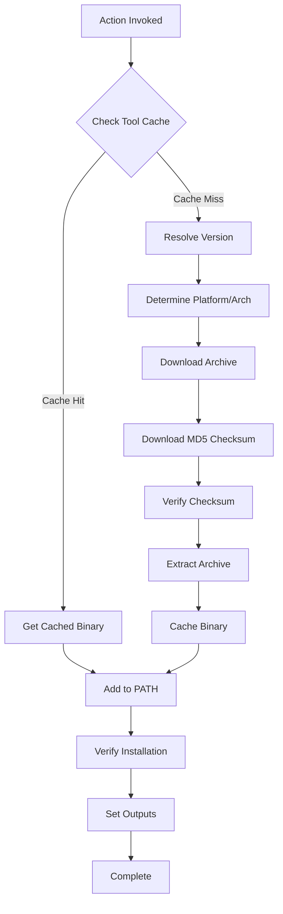

# GitHub Action Design Document

## Overview

This document describes the design for a GitHub Action that installs the rune binary into GitHub Actions runner environments. **This design prioritizes simplicity and maintainability** - the entire action is ~350 lines across just 2 files.

### Design Philosophy

**Simple is better than complex.** This design avoids common over-engineering patterns:

- ❌ No formal interfaces (no polymorphism needed)
- ❌ No custom error classes (standard `Error` is sufficient)
- ❌ No separate files per component (keeps related code together)
- ❌ No custom retry logic (library handles it)
- ❌ No input validation functions (API validates naturally)
- ✅ Just exported functions with clear responsibilities
- ✅ Trust battle-tested @actions libraries
- ✅ Clear error messages over error categorization

### Design Goals

1. **Simplicity**: Straightforward code that's easy to understand and modify
2. **Reliability**: Verify integrity and provide clear error messages
3. **Performance**: Use caching to minimize download times
4. **Compatibility**: Support all major platforms (Linux, macOS, Windows) and architectures (amd64, arm64)

### Design Constraints

- Must use TypeScript/JavaScript (GitHub Actions standard)
- Must follow GitHub Actions metadata conventions (action.yml)
- Must work with existing rune release artifact structure
- Must use MD5 checksums for integrity verification (matching current release process)
- Must not require changes to rune release process

## Architecture

### High-Level Flow



### Technology Stack

- **Language**: TypeScript (compiled to JavaScript)
- **Runtime**: Node.js 20 (GitHub Actions standard)
- **Primary Dependencies**:
  - `@actions/core` - Action inputs, outputs, logging
  - `@actions/tool-cache` - Download, extract, and cache management
  - `@actions/github` - GitHub API interactions
  - `@actions/exec` - Execute shell commands for verification

### Repository Structure

```
.
├── action.yml                 # Action metadata
├── src/
│   ├── main.ts               # Entry point (~100 lines)
│   └── install.ts            # All installation logic (~250 lines)
├── dist/
│   └── index.js              # Compiled bundle
├── __tests__/
│   └── install.test.ts       # All tests
├── package.json
├── tsconfig.json
└── README.md
```

**Rationale for simplicity**: For a ~350 line action, splitting into 5+ files adds unnecessary complexity. Two files provide clear separation (entry point vs. logic) while keeping related code together.

## Implementation

### main.ts (Entry Point)

```typescript
import * as core from '@actions/core';
import * as path from 'path';
import { installRune } from './install';

async function run(): Promise<void> {
  try {
    const version = core.getInput('version') || 'latest';
    const token = core.getInput('github-token') || process.env.GITHUB_TOKEN || '';

    const result = await installRune(version, token);

    core.setOutput('version', result.version);
    core.setOutput('path', result.path);

    core.info(`✓ rune ${result.version} installed successfully`);
  } catch (error) {
    core.setFailed(error instanceof Error ? error.message : String(error));
  }
}

run();
```

### install.ts (Core Logic)

This file contains all installation logic in simple, exported functions. No interfaces or classes needed.

**Key Functions**:

1. **`installRune(version, token)`** - Main orchestration function
2. **`resolveVersion(version, token)`** - Handle "latest" and validate versions
3. **`getPlatformAsset(version)`** - Detect platform and build asset name
4. **`verifyChecksum(filePath, checksumPath)`** - MD5 verification

```typescript
import * as core from '@actions/core';
import * as tc from '@actions/tool-cache';
import * as exec from '@actions/exec';
import * as crypto from 'crypto';
import * as fs from 'fs';
import * as path from 'path';
import { getOctokit } from '@actions/github';

export async function installRune(
  version: string,
  token: string
): Promise<{ version: string; path: string }> {

  // 1. Resolve version FIRST
  const resolvedVersion = await resolveVersion(version, token);

  // 2. Get platform info and asset name
  const { assetName, isWindows } = getPlatformAsset(resolvedVersion);
  const arch = process.arch === 'arm64' ? 'arm64' : 'amd64';

  // 3. Check cache
  const cachedPath = tc.find('rune', resolvedVersion, arch);
  if (cachedPath) {
    core.info(`Using cached rune ${resolvedVersion}`);
    core.addPath(cachedPath);
    return { version: resolvedVersion, path: cachedPath };
  }

  // 4. Download
  const baseUrl = `https://github.com/ArjenSchwarz/rune/releases/download/v${resolvedVersion}`;
  core.info(`Downloading rune ${resolvedVersion}...`);

  const archivePath = await tc.downloadTool(`${baseUrl}/${assetName}`, undefined, token);
  const checksumPath = await tc.downloadTool(`${baseUrl}/${assetName}.md5`, undefined, token);

  // 5. Verify checksum
  await verifyChecksum(archivePath, checksumPath);

  // 6. Extract
  const extractedPath = isWindows
    ? await tc.extractZip(archivePath)
    : await tc.extractTar(archivePath);

  // 7. Make executable (non-Windows)
  if (!isWindows) {
    const binaryPath = path.join(extractedPath, 'rune');
    await exec.exec('chmod', ['+x', binaryPath]);
  }

  // 8. Cache and add to PATH
  const cachedToolPath = await tc.cacheDir(extractedPath, 'rune', resolvedVersion, arch);
  core.addPath(cachedToolPath);

  core.info(`✓ Successfully installed rune ${resolvedVersion}`);
  return { version: resolvedVersion, path: cachedToolPath };
}

async function resolveVersion(version: string, token: string): Promise<string> {
  const octokit = getOctokit(token);
  const normalized = version.replace(/^v/, '');

  if (normalized === 'latest') {
    const { data } = await octokit.rest.repos.getLatestRelease({
      owner: 'ArjenSchwarz',
      repo: 'rune'
    });
    return data.tag_name.replace(/^v/, '');
  }

  // Verify exact version exists
  try {
    await octokit.rest.repos.getReleaseByTag({
      owner: 'ArjenSchwarz',
      repo: 'rune',
      tag: `v${normalized}`
    });
    return normalized;
  } catch (error: any) {
    if (error.status === 404) {
      throw new Error(
        `Version ${version} not found.\n` +
        `Check available versions at: https://github.com/ArjenSchwarz/rune/releases`
      );
    }
    throw error;
  }
}

function getPlatformAsset(version: string): { assetName: string; isWindows: boolean } {
  const osMap: Record<string, string> = {
    'linux': 'linux',
    'darwin': 'darwin',
    'win32': 'windows'
  };

  const archMap: Record<string, string> = {
    'x64': 'amd64',
    'arm64': 'arm64'
  };

  const os = osMap[process.platform];
  const arch = archMap[process.arch];

  if (!os || !arch) {
    throw new Error(
      `Unsupported platform: ${process.platform}-${process.arch}\n` +
      `Supported: linux/darwin/windows on amd64/arm64`
    );
  }

  const ext = os === 'windows' ? 'zip' : 'tar.gz';
  const assetName = `rune-v${version}-${os}-${arch}.${ext}`;

  return { assetName, isWindows: os === 'windows' };
}

async function verifyChecksum(filePath: string, checksumPath: string): Promise<void> {
  const expected = (await fs.promises.readFile(checksumPath, 'utf8')).trim();

  // Calculate MD5
  const hash = crypto.createHash('md5');
  const stream = fs.createReadStream(filePath);

  await new Promise<void>((resolve, reject) => {
    stream.on('data', data => hash.update(data));
    stream.on('end', () => resolve());
    stream.on('error', reject);
  });

  const actual = hash.digest('hex');

  if (expected !== actual) {
    throw new Error(
      `MD5 checksum verification failed!\n` +
      `Expected: ${expected}\n` +
      `Actual: ${actual}`
    );
  }

  core.info('✓ Checksum verified');
}
```

**Key Simplifications**:
- No interfaces - just exported functions
- No custom error class - standard `Error` with clear messages
- No separate verification step - trust @actions/tool-cache
- No custom retry logic - library handles it
- Platform detection returns asset info directly

## Data Models

### Complete action.yml

```yaml
name: 'Setup Rune'
description: 'Install the rune CLI binary for task management in GitHub Actions workflows'
author: 'ArjenSchwarz'

branding:
  icon: 'check-square'
  color: 'blue'

inputs:
  version:
    description: 'Version of rune to install (e.g., "1.0.0", "v1.0.0", or "latest")'
    required: false
    default: 'latest'

  github-token:
    description: 'GitHub token for API requests (helps avoid rate limiting). Defaults to the automatic GITHUB_TOKEN.'
    required: false
    default: ${{ github.token }}

outputs:
  version:
    description: 'The installed version of rune (e.g., "1.0.0")'

  path:
    description: 'The directory containing the rune binary'

runs:
  using: 'node20'
  main: 'dist/index.js'

# Note: Node20 is current standard (Nov 2025) but will reach EOL in April 2026.
# Plan to migrate to node24 in early 2026.
```

### Cache Key Format

```
rune-{version}-{arch}
```

Examples: `rune-1.0.0-amd64`, `rune-1.0.0-arm64`

**Note**: OS is not needed in cache key because @actions/tool-cache already isolates by runner OS.

## Error Handling

### Error Strategy

Use standard JavaScript `Error` objects with clear, helpful messages. GitHub Actions displays the error message to users, so focus on:

1. **What went wrong** - Clear description
2. **Why it happened** - Context when available
3. **How to fix** - Actionable guidance

### Error Message Examples

```typescript
// Version not found
throw new Error(
  `Version ${version} not found.\n` +
  `Check available versions at: https://github.com/ArjenSchwarz/rune/releases`
);

// Unsupported platform
throw new Error(
  `Unsupported platform: ${process.platform}-${process.arch}\n` +
  `Supported: linux/darwin/windows on amd64/arm64`
);

// Checksum failure
throw new Error(
  `MD5 checksum verification failed!\n` +
  `Expected: ${expected}\n` +
  `Actual: ${actual}`
);
```

### Built-in Retry

The `@actions/tool-cache` library handles retries internally. No custom retry logic needed.

## Testing Strategy

### Unit Tests

Test each function in `install.ts`:

1. **resolveVersion() Tests**
   - Test "latest" resolution
   - Test exact version normalization ("v1.0.0" → "1.0.0")
   - Test 404 error when version doesn't exist
   - Mock GitHub API responses

2. **getPlatformAsset() Tests**
   - Test asset name generation for all platforms
   - Test unsupported platform handling
   - Mock process.platform and process.arch

3. **verifyChecksum() Tests**
   - Test successful checksum verification
   - Test checksum mismatch detection
   - Test file reading errors

4. **installRune() Tests**
   - Test cache hit scenario
   - Test cache miss scenario
   - Test extraction for different platforms
   - Mock @actions/tool-cache functions

Example test structure:
```typescript
import { installRune, resolveVersion, getPlatformAsset } from '../src/install';

describe('resolveVersion', () => {
  test('handles latest version', async () => {
    mockGetLatestRelease.mockResolvedValue({ data: { tag_name: 'v1.0.0' } });
    const version = await resolveVersion('latest', 'token');
    expect(version).toBe('1.0.0');
  });

  test('strips v prefix from user input', async () => {
    mockGetReleaseByTag.mockResolvedValue({});
    const version = await resolveVersion('v1.0.0', 'token');
    expect(version).toBe('1.0.0');
  });

  test('throws helpful error for missing version', async () => {
    mockGetReleaseByTag.mockRejectedValue({ status: 404 });
    await expect(resolveVersion('99.99.99', 'token'))
      .rejects.toThrow('Version 99.99.99 not found');
  });
});

describe('getPlatformAsset', () => {
  test('generates correct asset name for Linux', () => {
    Object.defineProperty(process, 'platform', { value: 'linux', configurable: true });
    Object.defineProperty(process, 'arch', { value: 'x64', configurable: true });

    const { assetName } = getPlatformAsset('1.0.0');
    expect(assetName).toBe('rune-v1.0.0-linux-amd64.tar.gz');
  });

  test('throws error for unsupported platform', () => {
    Object.defineProperty(process, 'platform', { value: 'freebsd', configurable: true });
    expect(() => getPlatformAsset('1.0.0')).toThrow('Unsupported platform');
  });
});
```

### Integration Tests

Test the complete workflow:

1. **Successful Installation Test**
   ```yaml
   - name: Setup rune
     uses: ./
     with:
       version: '1.0.0'

   - name: Verify installation
     run: rune --version
   ```

2. **Latest Version Test**
   ```yaml
   - name: Setup rune (latest)
     uses: ./
     with:
       version: 'latest'

   - name: Check version output
     run: |
       if [ -z "${{ steps.setup.outputs.version }}" ]; then
         echo "Version output not set"
         exit 1
       fi
   ```

3. **Cache Test**
   ```yaml
   - name: First installation
     id: first
     uses: ./
     with:
       version: '1.0.0'

   - name: Second installation (should use cache)
     id: second
     uses: ./
     with:
       version: '1.0.0'

   - name: Verify both installed same version
     run: |
       if [ "${{ steps.first.outputs.version }}" != "${{ steps.second.outputs.version }}" ]; then
         echo "Version mismatch"
         exit 1
       fi
   ```

4. **Error Handling Test**
   ```yaml
   - name: Try to install non-existent version
     id: install
     uses: ./
     with:
       version: '999.999.999'
     continue-on-error: true

   - name: Verify it failed
     run: |
       if [ "${{ steps.install.outcome }}" != "failure" ]; then
         echo "Should have failed for non-existent version"
         exit 1
       fi
   ```

### Platform Matrix Testing

Test on all supported platforms:

```yaml
strategy:
  matrix:
    os: [ubuntu-latest, ubuntu-22.04, macos-latest, macos-13, windows-latest]
    version: ['1.0.0', 'latest']
```

### Test Coverage Goals

- Unit test coverage: ≥ 80%
- Integration test coverage: All critical user paths
- Platform coverage: All supported OS/arch combinations

## Implementation Plan

### Phase 1: Project Setup (1-2 hours)
1. Initialize TypeScript project with @actions dependencies
2. Configure build (use @vercel/ncc to bundle)
3. Create action.yml
4. Set up test infrastructure (Jest)

**Deliverable**: Empty action that can be built and tested

### Phase 2: Core Implementation (3-4 hours)
1. Implement `main.ts` entry point
2. Implement `install.ts` with all four functions:
   - `resolveVersion()`
   - `getPlatformAsset()`
   - `verifyChecksum()`
   - `installRune()`
3. Add basic error messages

**Deliverable**: Working installation flow

### Phase 3: Testing (2-3 hours)
1. Write unit tests for each function
2. Create integration test workflow
3. Test on Ubuntu, macOS, Windows

**Deliverable**: Tested action with >80% coverage

### Phase 4: Documentation & Release (1-2 hours)
1. Write README with usage examples
2. Build dist/index.js
3. Tag v1.0.0
4. Create GitHub release
5. Publish to marketplace (optional)

**Deliverable**: Published action

**Total Estimated Time**: 7-11 hours (vs. 15-20 hours for complex design)

## Security Considerations

### 1. Checksum Verification

- **Current State**: MD5 checksums provide integrity checking
- **Limitation**: MD5 is not cryptographically secure for tamper detection
- **Mitigation**: Downloads are from HTTPS-only URLs
- **Future Enhancement**: Consider SHA256 or GPG signatures

### 2. Token Handling

- Use GitHub token from action context (secure)
- Never log tokens in error messages or debug output
- Token is only used for API requests, not embedded in downloads

### 3. Input Validation

Version validation happens naturally through the GitHub API:
- If version doesn't exist, API returns 404 with helpful error
- No need for regex patterns or length checks
- Simpler and more reliable

### 4. Download Security

- Only download from `github.com` domain
- Use HTTPS for all requests
- Verify TLS certificates (default Node.js behavior)

## Performance Considerations

### Caching Strategy

The action uses GitHub Actions' tool cache, which:
- Persists across workflow runs
- Is scoped per runner
- Has a 10GB limit per repository

**Cache Key Design**:
```
rune-{version}-{os}-{arch}
```

This ensures:
- Different versions don't collide
- Different platforms don't share cache
- Maximum cache reuse for repeated runs

### Download Optimization

1. **Conditional Downloads**: Check cache before downloading
2. **Parallel Operations**: Download archive and checksum in parallel (future optimization)
3. **Compression**: Archives are already compressed (.tar.gz, .zip)

### Size Estimates

Based on v1.0.0 release:
- Darwin amd64: ~2.3 MB
- Linux amd64: ~2.2 MB
- Windows amd64: ~2.3 MB

Download times (estimated):
- GitHub-hosted runners: 1-2 seconds
- Cache retrieval: < 1 second

## Maintenance and Versioning

### Action Versioning

Follow semantic versioning with major version tags:
- `v1` - Latest v1.x.x release (recommended for users)
- `v1.0.0` - Specific pinned version
- `main` - Development branch (not recommended for production)

### Release Process

1. Update version in package.json
2. Run tests
3. Build distribution (`npm run build`)
4. Commit dist/ changes
5. Create git tag (e.g., `v1.0.0`)
6. Create GitHub release
7. Update major version tag (e.g., `v1`)

### Compatibility Commitments

- **v1.x.x**: No breaking changes to inputs/outputs
- **v2.x.x**: May introduce breaking changes with migration guide

## Future Enhancements

### Potential Future Features

1. **Semantic Version Constraints**
   - Support `~1.0.0`, `^1.0.0`, `>=1.0.0` syntax
   - Requires version resolution logic enhancement

2. **SHA256 Checksums**
   - Stronger integrity verification
   - Requires changes to rune release process

3. **GPG Signature Verification**
   - Cryptographic authenticity verification
   - Requires signing in release process

4. **Cache Hit Output**
   - Report whether binary came from cache
   - Useful for debugging and monitoring

5. **Version File Support**
   - Read version from `.rune-version` file
   - Similar to `.node-version` pattern

6. **Pre-release Support**
   - Allow installing pre-release versions
   - Add `include-prerelease` input option

### Non-Goals

The following are explicitly not in scope:

1. Installing rune from source
2. Building rune from Git
3. Managing multiple rune versions simultaneously
4. Installing rune plugins or extensions
5. Configuring rune (should be done in separate steps)
