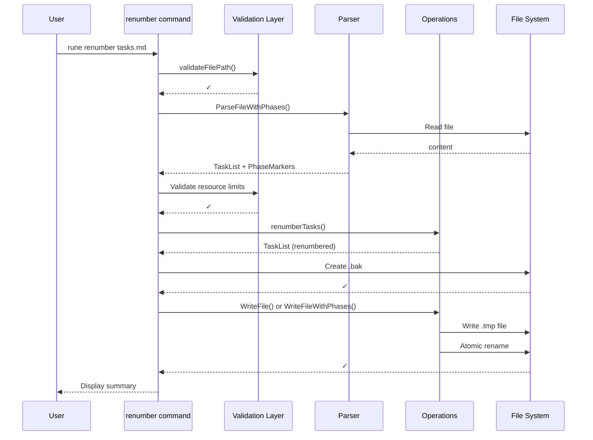

# Design Document: Renumber Command

## Overview

The `renumber` command fixes task numbering inconsistencies in rune task files by recalculating all task IDs using hierarchical sequential numbering (1, 1.1, 1.2, 2, 2.1...) while preserving the task hierarchy and order. This command is designed to recover from manual file edits that may have broken the numbering sequence.

### Key Design Goals

1. **Simplicity**: Leverage existing `renumberTasks()` function for core logic
2. **Safety**: Use atomic writes and automatic backups to prevent data loss
3. **Phase Awareness**: Preserve phase markers using established `WriteFileWithPhases` pattern
4. **Consistency**: Match the architecture and patterns of existing commands

## Architecture

### High-Level Flow



### Component Structure

```
cmd/renumber.go              # Cobra command definition
  ├─ runRenumber()           # Command execution handler
  ├─ createBackup()          # Backup file creation
  └─ displaySummary()        # Output formatting

internal/task/operations.go  # Existing renumbering logic
  ├─ renumberTasks()         # Core renumbering (ALREADY EXISTS)
  ├─ WriteFile()             # Atomic write (ALREADY EXISTS)
  └─ WriteFileWithPhases()   # Phase-aware write (ALREADY EXISTS)
```

## Components and Interfaces

### 1. Command Interface (cmd/renumber.go)

**Command Definition:**
```go
var renumberCmd = &cobra.Command{
    Use:   "renumber [file]",
    Short: "Fix task numbering in a file",
    Long: `Renumber recalculates all task IDs to create sequential numbering.

This command is useful when tasks have been manually reordered and the
hierarchical IDs need to be recalculated. It:
- Creates automatic backups (.bak extension)
- Uses global sequential numbering (1, 2, 3...)
- Preserves task hierarchy and metadata
- Preserves phase markers and YAML front matter`,
    Args: cobra.ExactArgs(1),
    RunE: runRenumber,
}
```

**Flags:**
- `--format` (inherited from root): Output format (table, markdown, json)
- No additional flags needed (design decision 1: no confirmation)

### 2. Main Execution Handler

```go
func runRenumber(cmd *cobra.Command, args []string) error {
    filePath := args[0]

    // Phase 1: Fast validation (before expensive operations)
    if err := task.ValidateFilePath(filePath); err != nil {
        return fmt.Errorf("invalid file path: %w", err)
    }

    fileInfo, err := os.Stat(filePath)
    if err != nil {
        return fmt.Errorf("file not found: %w", err)
    }

    if fileInfo.Size() > task.MaxFileSize {
        return fmt.Errorf("file exceeds 10MB limit")
    }

    // Phase 2: Parse file (includes hierarchy depth validation per Decision 11)
    taskList, phaseMarkers, err := task.ParseFileWithPhases(filePath)
    if err != nil {
        return fmt.Errorf("failed to parse task file: %w", err)
    }

    // Phase 3: Validate resource limits
    totalTasks := taskList.CountTotalTasks()
    if totalTasks >= task.MaxTaskCount {
        return fmt.Errorf("task count (%d) exceeds limit of %d",
            totalTasks, task.MaxTaskCount)
    }

    // Note: Hierarchy depth validation happens in ParseFileWithPhases per Decision 11

    // Phase 4: Create backup BEFORE any modifications
    backupPath, err := createBackup(filePath, fileInfo)
    if err != nil {
        return fmt.Errorf("failed to create backup: %w", err)
    }

    // Phase 5: Renumber tasks
    taskList.RenumberTasks() // Uses existing function

    // Phase 5.5: Update phase markers to reflect new task IDs
    // Note: renumberTasks() changes all task IDs, so phase markers need adjustment
    if len(phaseMarkers) > 0 {
        phaseMarkers = adjustPhaseMarkersAfterRenumber(phaseMarkers, taskList)
    }

    // Phase 6: Write file (atomic operation)
    if len(phaseMarkers) > 0 {
        err = task.WriteFileWithPhases(taskList, phaseMarkers, filePath)
    } else {
        err = taskList.WriteFile(filePath)
    }

    if err != nil {
        return fmt.Errorf("failed to write file: %w", err)
    }

    // Phase 7: Display summary
    displaySummary(taskList, backupPath, format)

    return nil
}
```

### 3. Backup Creation

**Function Signature:**
```go
func createBackup(filePath string, fileInfo os.FileInfo) (backupPath string, err error)
```

**Implementation Strategy:**
```go
func createBackup(filePath string, fileInfo os.FileInfo) (string, error) {
    backupPath := filePath + ".bak"

    // Read original file
    content, err := os.ReadFile(filePath)
    if err != nil {
        return "", fmt.Errorf("reading original file: %w", err)
    }

    // Write backup (overwrites existing .bak per requirement 3.4)
    if err := os.WriteFile(backupPath, content, fileInfo.Mode().Perm()); err != nil {
        return "", fmt.Errorf("writing backup: %w", err)
    }

    return backupPath, nil
}
```

**Design Rationale:**
- Backup created AFTER parsing succeeds (per Decision 7)
- Backup created BEFORE any write operations begin (per Requirement 3.5)
- Simple copy operation - no atomic write needed for backup itself
- Overwrites existing .bak files (per Requirement 3.4)
- Accepts fileInfo parameter to avoid redundant os.Stat() call

### 4. Phase Marker Adjustment

**Problem**: The `renumberTasks()` function changes all task IDs in the TaskList. Phase markers store `AfterTaskID` values that reference the old task IDs. After renumbering, these references become stale and must be updated to point to the new task IDs.

**Function Signature:**
```go
func adjustPhaseMarkersAfterRenumber(markers []task.PhaseMarker, tl *task.TaskList) []task.PhaseMarker
```

**Implementation Strategy:**

The renumbering is deterministic - tasks maintain their order, only their IDs change. Therefore, we can map old positions to new IDs by traversing the renumbered task list.

```go
func adjustPhaseMarkersAfterRenumber(markers []task.PhaseMarker, tl *task.TaskList) []task.PhaseMarker {
    // Build a map of task titles to their new IDs
    // We use titles because they don't change during renumbering
    titleToID := make(map[string]string)
    buildTitleMap(tl.Tasks, titleToID)

    // Adjust each phase marker's AfterTaskID
    adjustedMarkers := make([]task.PhaseMarker, len(markers))
    for i, marker := range markers {
        adjustedMarkers[i] = marker

        if marker.AfterTaskID == "" {
            // Phase at beginning of file - no adjustment needed
            continue
        }

        // Find the task with the old ID and get its new ID
        // We locate the task by its position in the original ordering
        oldTask := findTaskAtPosition(tl, marker.AfterTaskID)
        if oldTask != nil {
            adjustedMarkers[i].AfterTaskID = oldTask.ID
        }
        // If task not found, keep original marker (edge case)
    }

    return adjustedMarkers
}

// Helper to build title->ID map recursively
func buildTitleMap(tasks []task.Task, titleMap map[string]string) {
    for _, t := range tasks {
        titleMap[t.Title] = t.ID
        buildTitleMap(t.Children, titleMap)
    }
}

// Helper to find task at specific position (by traversing in order)
func findTaskAtPosition(tl *task.TaskList, targetID string) *task.Task {
    // Parse targetID to determine position
    // For simple case: task "3" is 3rd root task
    // For nested: task "2.3" is 3rd child of 2nd root task
    // Implementation would walk the tree based on parsed position
    // This uses the same logic as the existing renumberTasks function
    return task.FindTaskByID(tl, targetID)
}
```

**Alternative Simpler Approach** (Recommended):

Since phase markers are positional (they mark where phases appear between tasks), we can use a simpler approach: track the number of root-level tasks before each phase marker, then use that count after renumbering.

```go
func adjustPhaseMarkersAfterRenumber(markers []task.PhaseMarker, tl *task.TaskList) []task.PhaseMarker {
    adjustedMarkers := make([]task.PhaseMarker, len(markers))

    for i, marker := range markers {
        adjustedMarkers[i] = marker

        if marker.AfterTaskID == "" {
            // Phase at beginning - no adjustment needed
            continue
        }

        // Get the root task number from the ID
        // e.g., "3" -> 3, "3.2.1" -> 3 (all reference root task 3)
        rootTaskNum := getRootTaskNumber(marker.AfterTaskID)

        // After renumbering, root tasks are numbered 1, 2, 3...
        // So the phase is still after root task N
        adjustedMarkers[i].AfterTaskID = fmt.Sprintf("%d", rootTaskNum)
    }

    return adjustedMarkers
}

// Extract root task number from hierarchical ID
func getRootTaskNumber(taskID string) int {
    parts := strings.Split(taskID, ".")
    num, _ := strconv.Atoi(parts[0])
    return num
}
```

**Design Rationale:**
- Phase markers are positional - they mark boundaries between sections of tasks
- After renumbering, tasks maintain their order, so phase positions remain valid
- We only need to update the AfterTaskID strings to match the new ID format
- The simpler approach works because renumberTasks() maintains task order
- This mirrors the logic used in `RemoveTaskWithPhases` (operations.go:714-734)

### 5. Output Formatting

**Function Signature:**
```go
func displaySummary(tl *task.TaskList, backupPath, format string) error
```

**Output Structure:**

**Table Format:**
```
Renumbering Summary
─────────────────────────────────────
Total Tasks:    42
Backup File:    tasks.md.bak
Status:         ✓ Success
```

**JSON Format:**
```json
{
  "task_count": 42,
  "backup_file": "tasks.md.bak",
  "success": true
}
```

**Markdown Format:**
```markdown
# Renumbering Summary

- **Total Tasks**: 42
- **Backup File**: tasks.md.bak
- **Status**: ✓ Success
```

**Implementation:**
```go
func displaySummary(tl *task.TaskList, backupPath, format string) error {
    totalTasks := tl.CountTotalTasks()

    switch format {
    case "json":
        data := map[string]any{
            "task_count":  totalTasks,
            "backup_file": backupPath,
            "success":     true,
        }
        encoder := json.NewEncoder(os.Stdout)
        encoder.SetIndent("", "  ")
        return encoder.Encode(data)

    case "markdown":
        fmt.Println("# Renumbering Summary\n")
        fmt.Printf("- **Total Tasks**: %d\n", totalTasks)
        fmt.Printf("- **Backup File**: %s\n", backupPath)
        fmt.Println("- **Status**: ✓ Success")
        return nil

    case "table":
        fallthrough
    default:
        // Use go-output library for consistent formatting
        outputs := output.NewOutput("table", false)
        outputs.AddHeader("Renumbering Summary", "")
        outputs.SetSeparator("─────────────────────────────────────")
        outputs.AddRow("Total Tasks:", fmt.Sprintf("%d", totalTasks))
        outputs.AddRow("Backup File:", backupPath)
        outputs.AddRow("Status:", "✓ Success")
        outputs.Print(context.Background())
        return nil
    }
}
```

## Data Models

### Input Data

The command operates on existing data structures:

```go
// From internal/task/task.go (EXISTING)
type TaskList struct {
    Title            string
    Tasks            []Task
    FrontMatter      *FrontMatter
    FilePath         string
    RequirementsFile string
    Modified         time.Time
}

type Task struct {
    ID           string
    Title        string
    Status       Status
    Details      []string
    References   []string
    Requirements []string
    Children     []Task
    ParentID     string
}

// From internal/task/phase.go (EXISTING)
type PhaseMarker struct {
    Name        string // Phase name from H2 header
    AfterTaskID string // ID of task that precedes this phase
}
```

### Output Data (JSON format)

```go
type RenumberResult struct {
    TaskCount  int    `json:"task_count"`
    BackupFile string `json:"backup_file"`
    Success    bool   `json:"success"`
}
```

## Error Handling

### Error Categories and Responses

| Error Category | Validation Point | Error Message Format | Exit Code |
|----------------|------------------|----------------------|-----------|
| **File Not Found** | Phase 1 | `file not found: %w` | 1 |
| **Invalid Path** | Phase 1 | `invalid file path: %w` | 1 |
| **File Too Large** | Phase 1 | `file exceeds 10MB limit` | 1 |
| **Parse Error** | Phase 2 | `failed to parse task file: %w` | 1 |
| **Too Many Tasks** | Phase 3 | `task count (%d) exceeds limit of %d` | 1 |
| **Hierarchy Too Deep** | Phase 3 | `hierarchy depth (%d) exceeds limit of %d` | 1 |
| **Backup Failed** | Phase 4 | `failed to create backup: %w` | 1 |
| **Write Failed** | Phase 6 | `failed to write file: %w` | 1 |
| **Disk Full** | Phase 6 | `failed to write file: %w` (underlying error from OS) | 1 |

### Error Recovery

**Guarantee: Original file remains unmodified on ANY error** (Requirement 2.8)

**Phase 1-3 Failures:**
- No modifications made
- No cleanup needed
- Original file untouched

**Phase 4 Failure (Backup):**
- Command aborts
- Original file untouched
- Partial .bak file may exist but is safe to ignore

**Phase 5 Failure (Renumber):**
- In-memory operation only
- Original file untouched
- Backup file exists but can be ignored

**Phase 6 Failure (Write):**
- Atomic write pattern: write to .tmp → rename
- If write to .tmp fails: original file untouched, .tmp cleaned up automatically
- If rename fails: original file untouched, .tmp cleaned up by error handler
- Backup file exists as recovery point

**Temporary File Cleanup (Requirement 2.9):**
```go
// WriteFile already implements this pattern (operations.go:312-322)
tmpFile := filePath + ".tmp"
if err := os.WriteFile(tmpFile, content, perm); err != nil {
    return fmt.Errorf("writing temp file: %w", err)
}

if err := os.Rename(tmpFile, filePath); err != nil {
    os.Remove(tmpFile)  // Cleanup on failure
    return fmt.Errorf("atomic rename: %w", err)
}
```

**Interruption Handling:**

If the command is interrupted (Ctrl+C) at any point:
- **Before backup creation**: No changes made, original file intact
- **After backup, before write**: Original file intact, .bak file exists (can be safely deleted)
- **During atomic write**: Original file intact (atomic rename hasn't happened yet), .tmp and .bak exist
- **After successful write**: Renumbering complete, .bak contains pre-renumber state

In all cases, the original file remains safe until the atomic rename completes.

### Edge Case Handling

**Empty File (Requirement 7.1):**
- `ParseFileWithPhases` returns empty TaskList
- `CountTotalTasks()` returns 0
- Command succeeds with "Total Tasks: 0" output

**File with Only Phase Markers (Requirement 7.2):**
- `ParseFileWithPhases` returns TaskList with empty Tasks array
- PhaseMarkers extracted successfully
- Command succeeds, phase markers preserved

**Malformed Hierarchy (Requirement 7.3):**
- `ParseFileWithPhases` validates hierarchy during parsing
- Returns error: "invalid hierarchy: task 1.1 exists but parent task 1 not found"
- Command aborts in Phase 2 before any modifications

**Duplicate Task IDs (Requirement 7.4):**
- `ParseFileWithPhases` detects duplicates during parsing
- Returns error: "duplicate task ID found: 2.1"
- Command aborts in Phase 2 before any modifications

**Disk Full (Requirement 7.5):**
- `os.WriteFile` in Phase 6 returns "no space left on device" error
- Atomic write pattern ensures original file untouched
- Temp file automatically cleaned up
- User sees error: "failed to write file: no space left on device"

## Testing Strategy

### Unit Tests (cmd/renumber_test.go)

**Test Categories:**

1. **Validation Tests**
   ```go
   - TestRenumberInvalidPath
   - TestRenumberFileTooLarge
   - TestRenumberTooManyTasks
   - TestRenumberHierarchyTooDeep
   ```

2. **Backup Tests**
   ```go
   - TestCreateBackup
   - TestBackupPreservesPermissions
   - TestBackupOverwritesExisting
   ```

3. **Renumbering Logic Tests**
   ```go
   - TestRenumberSimpleFile
   - TestRenumberWithHierarchy
   - TestRenumberWithPhases
   - TestRenumberWithFrontMatter
   - TestRenumberPreservesTaskOrder
   - TestRenumberPreservesMetadata
   ```

4. **Output Format Tests**
   ```go
   - TestDisplaySummaryTable
   - TestDisplaySummaryJSON
   - TestDisplaySummaryMarkdown
   ```

5. **Edge Case Tests**
   ```go
   - TestRenumberEmptyFile
   - TestRenumberPhasesOnly
   - TestRenumberMalformedHierarchy
   - TestRenumberDuplicateIDs
   ```

6. **Error Recovery Tests**
   ```go
   - TestRenumberRollbackOnWriteFailure
   - TestRenumberCleanupTempFiles
   ```

### Integration Tests (cmd/integration_test.go)

**Test Scenarios:**

1. **End-to-End Workflow**
   ```go
   - TestIntegrationRenumberCommand
   - TestIntegrationRenumberWithPhases
   - TestIntegrationRenumberPreservesFrontMatter
   ```

2. **File System Operations**
   ```go
   - TestIntegrationBackupCreation
   - TestIntegrationAtomicWrite
   - TestIntegrationPermissionPreservation
   ```

3. **Large File Handling**
   ```go
   - TestIntegrationRenumberLargeFile (9.5MB, 9000 tasks)
   - TestIntegrationRenumberMaxDepth (10 levels)
   ```

### Test Fixtures

**Required Test Files (examples/ directory):**
- `simple_tasks.md` - Basic sequential tasks
- `tasks_with_gaps.md` - Tasks with numbering gaps (1, 2, 5, 7)
- `tasks_with_phases.md` - Tasks with phase markers
- `tasks_with_frontmatter.md` - Tasks with YAML front matter
- `tasks_malformed.md` - Invalid hierarchy for error testing
- `empty.md` - Empty file
- `phases_only.md` - Only phase markers, no tasks

### Test Coverage Goals

- Line coverage: 80%+ (per project standard)
- Branch coverage: 75%+
- All error paths tested
- All edge cases covered

## Implementation Plan

### Phase 1: Core Command Structure
**Files**: `cmd/renumber.go`
1. Create cobra command definition
2. Implement `runRenumber()` skeleton
3. Add command registration in `cmd/root.go`
4. Wire up global `--format` flag

### Phase 2: Backup Functionality
**Files**: `cmd/renumber.go`
1. Implement `createBackup()` function
2. Add backup creation to `runRenumber()` (Phase 4)
3. Unit tests for backup creation

### Phase 3: Validation Integration
**Files**: `cmd/renumber.go`, `internal/task/operations.go`
1. Add validation phase to `runRenumber()` (Phases 1-3)
2. Export `validateFilePath()` function (capitalize it)
3. Export `countTotalTasks()` method on TaskList (capitalize to `CountTotalTasks()`)
4. Verify parser includes depth validation per Decision 11
5. Unit tests for validation

### Phase 4: Renumbering and Phase Marker Adjustment
**Files**: `cmd/renumber.go`
1. Export `renumberTasks()` method (capitalize to `RenumberTasks()`)
2. Implement `adjustPhaseMarkersAfterRenumber()` helper function
3. Implement `getRootTaskNumber()` helper function
4. Integrate renumbering and phase marker adjustment in Phase 5
5. Integrate `WriteFile` and `WriteFileWithPhases` in Phase 6
6. Unit tests for renumbering with various file types
7. Unit tests for phase marker adjustment logic

### Phase 5: Output Formatting
**Files**: `cmd/renumber.go`
1. Implement `displaySummary()` with all three formats
2. Use go-output library for table format consistency
3. Unit tests for output formatting

### Phase 6: Error Handling
**Files**: `cmd/renumber.go`
1. Add comprehensive error handling to all phases
2. Ensure proper error wrapping with context
3. Unit tests for all error paths

### Phase 7: Edge Cases
**Files**: `cmd/renumber.go`, test files
1. Add edge case handling (empty files, phase-only files)
2. Create test fixtures
3. Unit tests and integration tests

### Phase 8: Integration Testing
**Files**: `cmd/integration_test.go`
1. Add integration test suite
2. Test with realistic file sizes and structures
3. Test backup and atomic write behavior
4. Add test for write failure with cleanup verification
5. Add test for symlink security handling
6. Add test for malformed phase markers

### Phase 9: Documentation
**Files**: `README.md`, `cmd/renumber.go`
1. Update README with renumber command documentation
2. Add usage examples
3. Document backup file behavior
4. Document interruption handling

## Security Considerations

### Path Traversal Protection
- **Mitigation**: Use existing `validateFilePath()` function (operations.go:329-363)
- **Coverage**: Prevents both absolute and relative path traversal
- **Implementation**: Already enforces working directory boundary (requirement 2.5)

### Resource Exhaustion
- **Mitigation**: Enforce existing resource limits
  - MaxFileSize: 10MB (requirement 2.4)
  - MaxTaskCount: 10,000 tasks (requirement 2.6)
  - MaxHierarchyDepth: 10 levels (requirement 2.7)
- **Implementation**: Check limits before processing

### Atomic Operations
- **Mitigation**: Use existing atomic write pattern (operations.go:311-322)
- **Coverage**: Prevents partial writes and file corruption
- **Implementation**: Write to .tmp → atomic rename (requirement 1.10)

### Permission Preservation
- **Mitigation**: Copy file permissions to backup and new file
- **Implementation**: Use `os.Stat()` to get original permissions, apply to backup and output

## Dependencies

### Existing Internal Dependencies
- `internal/task` - All core task operations
  - `ParseFileWithPhases()` - File parsing
  - `renumberTasks()` - Renumbering logic
  - `WriteFile()` - Standard file writing
  - `WriteFileWithPhases()` - Phase-aware file writing
  - `validateFilePath()` - Path validation
  - Resource limit constants

### External Dependencies
- `github.com/spf13/cobra` - CLI framework (already used)
- `github.com/ArjenSchwarz/go-output/v2` - Output formatting (already used)
- Standard library: `os`, `fmt`, `encoding/json`, `context`

### No New Dependencies Required
All functionality can be implemented using existing dependencies.

## Performance Considerations

### Expected Performance Characteristics

**Small Files** (< 100 tasks):
- Parse time: < 10ms
- Renumber time: < 1ms
- Write time: < 5ms
- Total: < 20ms

**Medium Files** (1,000 tasks):
- Parse time: < 50ms
- Renumber time: < 10ms
- Write time: < 20ms
- Total: < 100ms

**Large Files** (10,000 tasks, max limit):
- Parse time: < 500ms
- Renumber time: < 100ms
- Write time: < 200ms
- Total: < 1 second

### Memory Usage

**Peak Memory** (10,000 tasks):
- TaskList in memory: ~5MB (estimated)
- File content buffers: ~10MB (original + backup)
- Total: ~15MB peak memory usage

### Optimization Notes

1. **No optimization needed**: The `renumberTasks()` function already operates in O(n) time where n is the total number of tasks.
2. **Single pass**: File is parsed once, renumbered once, written once.
3. **No copying**: Renumbering modifies IDs in-place in memory.
4. **Atomic write**: Adds one additional write operation but necessary for safety.

## Future Enhancements

### Out of Scope for MVP

These features are explicitly not included in the initial implementation:

1. **Dry-run mode** - Preview changes without applying them
   - Rationale: Backup file provides safety net; can be added later if requested

2. **Requirement link updating** - Update [Req X.Y] references automatically
   - Rationale: Design Decision 6 explicitly excludes this for simplicity

3. **Batch operation support** - Renumber multiple files at once
   - Rationale: Single-file operation is sufficient for MVP

4. **Undo/restore command** - Automatically restore from backup
   - Rationale: Users can manually copy .bak file; dedicated undo command can be added later

5. **Interactive mode** - Show preview and ask for confirmation
   - Rationale: Design Decision 1 explicitly chose no confirmation

### Potential Future Additions

If user feedback indicates these would be valuable:

1. Add `--dry-run` flag to preview changes
2. Add `--no-backup` flag to skip backup creation
3. Add `rune restore <file>` command to restore from .bak
4. Add `--update-links` flag to optionally update requirement links
5. Add support for renumbering in batch operations JSON API
