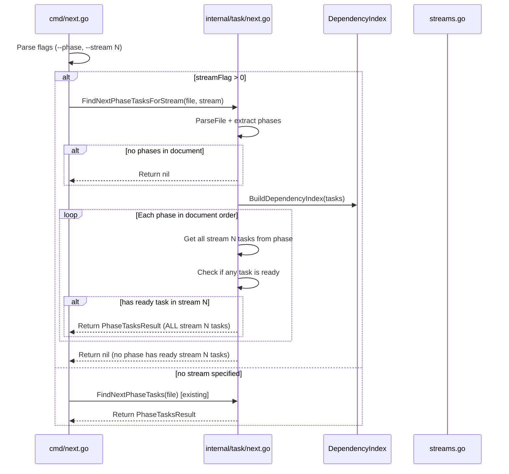
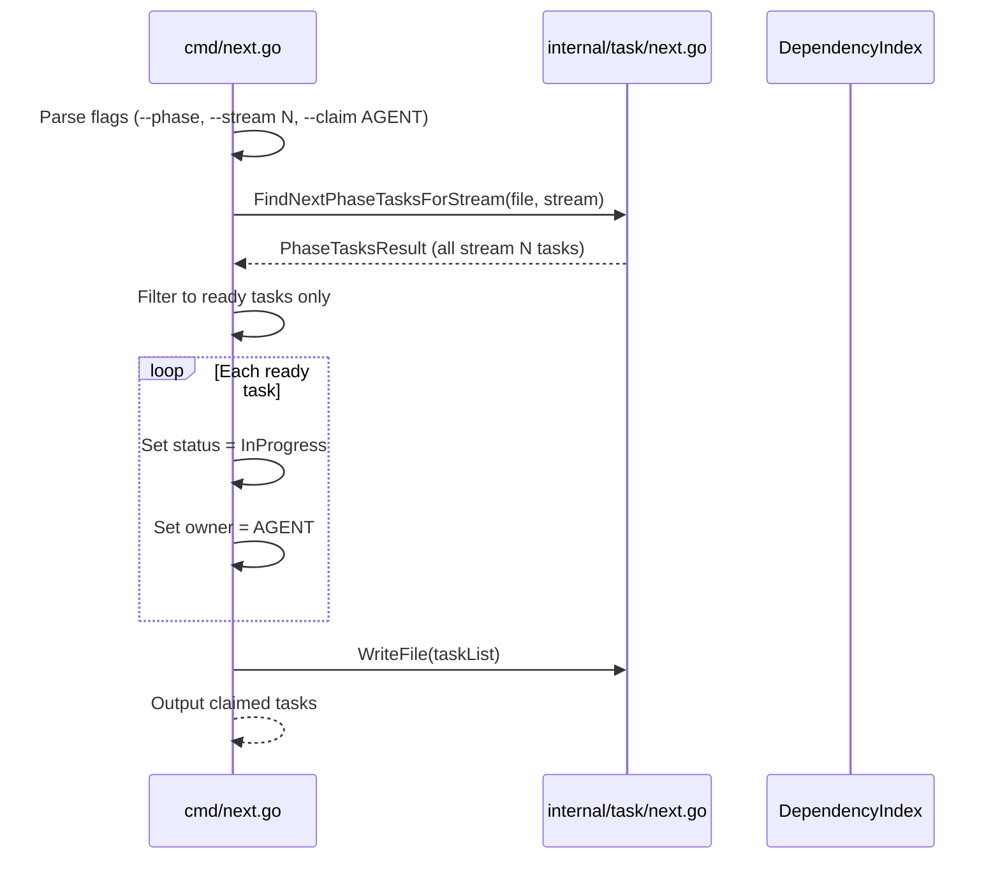

# Design: Stream-Aware Phase Navigation

## Overview

This design modifies the `next --phase` command to support stream-aware phase discovery. When both `--phase` and `--stream N` flags are provided, the system finds the first phase containing ready tasks in stream N, then returns **all tasks** in that stream from that phase (including blocked tasks with blocking status).

The implementation adds a new function `FindNextPhaseTasksForStream` in `internal/task/next.go` and modifies the command handler in `cmd/next.go` to use it when both flags are specified.

**Key behavior distinction:**
- **Phase selection**: Based on having at least one ready task in stream N
- **Task return**: All tasks in stream N from the selected phase (including blocked)
- **Claim**: Only claims ready tasks (blocked tasks cannot be claimed)

## Architecture

### Current Flow (Problem)

```
┌─────────────────────────────────────────────────────────────────┐
│ cmd/next.go: runNextPhase()                                     │
├─────────────────────────────────────────────────────────────────┤
│ 1. Call FindNextPhaseTasks(filename)                            │
│    └─ Returns first phase with ANY pending tasks                │
│ 2. Filter result by stream (if --stream specified)              │
│    └─ May return empty if phase has no stream N tasks           │
│ 3. Output result                                                │
└─────────────────────────────────────────────────────────────────┘
```

### New Flow (Solution)

```
┌─────────────────────────────────────────────────────────────────┐
│ cmd/next.go: runNextPhase()                                     │
├─────────────────────────────────────────────────────────────────┤
│ if streamFlag > 0:                                              │
│   1. Call FindNextPhaseTasksForStream(filename, stream, index)  │
│      └─ Returns first phase with READY tasks in stream N        │
│   2. Output result (already filtered)                           │
│ else:                                                           │
│   1. Call FindNextPhaseTasks(filename) [existing behavior]      │
│   2. Output result                                              │
└─────────────────────────────────────────────────────────────────┘
```

### Component Interaction



### Claim Flow (--phase --stream --claim)



## Components and Interfaces

### New Function: `FindNextPhaseTasksForStream`

**Location:** `internal/task/next.go`

```go
// FindNextPhaseTasksForStream finds all tasks in stream N from the first phase
// that has at least one ready task in that stream.
//
// Phase selection requires at least one "ready" task:
// - Status is Pending
// - No owner assigned
// - Not blocked (all dependencies completed)
//
// Task return includes ALL stream N tasks from the phase (including blocked).
//
// Returns nil if no phase contains ready tasks in the specified stream,
// or if the document has no phases.
func FindNextPhaseTasksForStream(filepath string, stream int) (*PhaseTasksResult, error)
```

**Parameters:**
- `filepath`: Path to the task markdown file
- `stream`: The stream number to filter by (must be > 0)

**Returns:**
- `*PhaseTasksResult`: Contains phase name and all stream N tasks (with blocking status), or nil if none found
- `error`: File read or parse errors

**Behavior:**
1. Parse the file and build dependency index
2. Extract phases with their task ranges
3. If no phases exist, return nil (phases required for phase-based navigation)
4. For each phase in document order:
   - Get all tasks in stream N using `GetEffectiveStream`
   - Check if any are ready (pending + no owner + not blocked)
   - If at least one ready task exists, return ALL stream N tasks from this phase
5. If no phase has ready tasks in stream N, return nil

### Reused Function: `FilterByStream`

**Location:** `internal/task/streams.go` (existing)

```go
// FilterByStream returns tasks belonging to the specified stream.
// Uses GetEffectiveStream to handle default stream (1) for tasks without explicit stream.
func FilterByStream(tasks []Task, stream int) []Task
```

This existing function is reused rather than creating a duplicate.

### New Helper: `hasReadyTaskInStream`

**Location:** `internal/task/next.go`

```go
// hasReadyTaskInStream checks if any task in the stream is ready.
// Ready means: Pending status, no owner, not blocked.
func hasReadyTaskInStream(tasks []Task, stream int, index *DependencyIndex) bool
```

### Modified Function: `runNextPhase`

**Location:** `cmd/next.go`

The existing `runNextPhase` function will be modified to:
1. Check if `streamFlag > 0`
2. If yes, call `FindNextPhaseTasksForStream` instead of `FindNextPhaseTasks`
3. Handle the nil return with appropriate error message
4. Existing path remains unchanged for backward compatibility

### Modified Function: `runNextWithClaim` (for claim integration)

**Location:** `cmd/next.go`

When `--phase`, `--stream`, and `--claim` are all specified:
1. Use stream-aware phase discovery to find the phase
2. Claim all ready tasks in that stream from that phase
3. Write file and output results

## Data Models

### Existing Types (No Changes Required)

| Type | Location | Purpose |
|------|----------|---------|
| `PhaseTasksResult` | `internal/task/next.go` | Returned by phase discovery functions |
| `PhaseWithTasks` | `internal/task/next.go` | Internal struct for phase iteration |
| `DependencyIndex` | `internal/task/dependencies.go` | Fast lookup for blocking checks |
| `Task` | `internal/task/task.go` | Core task struct with Stream field |

### PhaseTasksResult (Unchanged)

```go
type PhaseTasksResult struct {
    PhaseName string   // Name of the phase (empty if no phases in document)
    Tasks     []Task   // Tasks from this phase
}
```

The existing structure is sufficient. The `Tasks` slice contains all stream N tasks from the selected phase.

### Blocking Status in Output

Blocking status is computed at output time using the `DependencyIndex`, not stored in the result. The output functions receive both the `PhaseTasksResult` and `DependencyIndex` and compute blocking status per task.

**JSON output** adds a `blocked` boolean and `blockedBy` array per task. The `blockedBy` array contains hierarchical task IDs (user-visible IDs like "1", "2.1") translated from internal stable IDs using `DependencyIndex.TranslateToHierarchical`:
```json
{
  "phase": "Phase B",
  "tasks": [
    {"id": "1", "title": "Task B1", "status": "pending", "blocked": false, "blockedBy": []},
    {"id": "2", "title": "Task B2", "status": "pending", "blocked": true, "blockedBy": ["1"]}
  ]
}
```

**Table output** adds a "Status" indicator:
```
ID  Title     Status
1   Task B1   [ ] (ready)
2   Task B2   [ ] (blocked)
```

**Markdown output** adds blocking notation with hierarchical IDs:
```markdown
- [ ] 1. Task B1
- [ ] 2. Task B2 (blocked by: 1)
```

### Claim Output Contents

When `--phase --stream N --claim` is used:
- Phase discovery uses stream-aware logic
- Only ready tasks are claimed (status set to InProgress, owner assigned)
- Output contains **only the claimed tasks** (consistent with existing `--claim` behavior)

Tasks that were blocked or owned are not included in claim output.

### Task States in Results

For `--phase --stream N` (without claim), returned tasks can be in these states:

| State | Included in Results | Claimable |
|-------|---------------------|-----------|
| Pending + no owner + not blocked (ready) | Yes | Yes |
| Pending + no owner + blocked | Yes | No |
| Pending + owned by another agent | Yes | No |
| InProgress | Yes (if in stream) | No |
| Completed | No | No |

This differs from `--phase` alone, which uses `hasIncompleteWork` (any non-completed task). The stream-aware variant returns all non-completed tasks in the stream to show the full scope of work.

## Error Handling

### Error Cases

| Scenario | Current Behavior | New Behavior |
|----------|------------------|--------------|
| File not found | Return error | No change |
| Parse error | Return error | No change |
| No phases in document, `--phase --stream N` | "No pending tasks found in stream N" | "No ready tasks found in stream N" |
| No ready tasks in stream N (all blocked) | N/A (filtered after) | "No ready tasks found in stream N" |
| Stream N doesn't exist in any phase | N/A | "No ready tasks found in stream N" |
| Stream 0 with `--phase` | Falls through to existing | No change (backward compat) |
| `--phase --stream N --claim` with no ready tasks | N/A | "No ready tasks to claim in stream N" |

### Error Messages

New error message for stream-aware phase discovery:
```
No ready tasks found in stream N
```

This replaces the current message "No pending tasks found in stream N" to accurately reflect that we're checking for ready (not just pending) tasks.

**Note:** Error message text is not part of the stable API. Scripts should check exit codes rather than parsing messages.

### Error Message Functions

Modify `outputNextPhaseEmpty` to accept stream context:

```go
// When stream is specified
fmt.Sprintf("No ready tasks found in stream %d", stream)

// When no stream (existing behavior)
"No pending tasks found in any phase!"
```

## Testing Strategy

### Unit Tests

#### 1. `FindNextPhaseTasksForStream` Tests

**Location:** `internal/task/next_test.go`

| Test Case | Input | Expected Output |
|-----------|-------|-----------------|
| Single phase, stream exists | Phase A: tasks in streams 1,2 | Returns ALL stream N tasks from Phase A |
| First phase lacks stream | Phase A: stream 1 only; Phase B: streams 1,2 | Returns ALL stream 2 tasks from Phase B |
| All phases lack stream | All phases have stream 1 only | Returns nil |
| Stream tasks all blocked | Phase A: stream 2 tasks all blocked | Returns nil (skips phase, no ready tasks) |
| No phases in document | Flat task list | Returns nil |
| Tasks before first phase | Orphan tasks before `## Phase A` | Excludes orphan tasks |
| Empty phases skipped | Phase A empty; Phase B has stream 2 | Returns Phase B stream 2 tasks |
| Mixed ready/blocked in stream | Some stream 2 tasks ready, some blocked | Returns ALL stream 2 tasks (both ready and blocked) |
| Intra-phase dependencies | Task A ready, Task B blocked by A, both stream 2 | Returns both A and B |

#### 2. `hasReadyTaskInStream` Tests

| Test Case | Expected |
|-----------|----------|
| Has pending + no owner + unblocked task | Returns true |
| All tasks blocked | Returns false |
| All tasks owned | Returns false |
| All tasks InProgress/Completed | Returns false |
| No tasks in stream | Returns false |

#### 3. Task State Handling Tests

| Test Case | Expected |
|-----------|----------|
| Owned task (pending + owner) in stream | Included in results, not claimable |
| InProgress task in stream | Included in results, not claimable |
| Multiple task states in phase | All non-completed returned |

### Integration Tests

**Location:** `cmd/integration_test.go`

#### Test: Stream-Aware Phase Navigation

```go
func TestIntegration_NextPhaseStream(t *testing.T) {
    // Setup: Create file with:
    // ## Phase A
    // - [ ] 1. Task A1 (stream 1)
    // ## Phase B
    // - [ ] 2. Task B1 (stream 1)
    // - [ ] 3. Task B2 (stream 2)

    // Test 1: next --phase --stream 2
    // Expected: Returns Phase B with Task B2

    // Test 2: next --phase --stream 1
    // Expected: Returns Phase A with Task A1

    // Test 3: next --phase (no stream)
    // Expected: Returns Phase A (backward compat)
}
```

#### Test: Blocked Tasks Included in Output

```go
func TestIntegration_NextPhaseStreamWithBlockedTasks(t *testing.T) {
    // Setup: Create file with:
    // ## Phase A
    // - [ ] 1. Task A1 (stream 2) <!-- id:abc1234 -->
    // - [ ] 2. Task A2 (stream 2)
    //   Blocked-by: abc1234 (Task A1)

    // Test: next --phase --stream 2
    // Expected: Returns Phase A with BOTH Task A1 and A2
    // Verify: A2 has blocked status indicated in output
}
```

#### Test: All Stream Tasks Blocked Skips Phase

```go
func TestIntegration_NextPhaseStreamAllBlocked(t *testing.T) {
    // Setup: Create file with:
    // ## Phase A
    // - [ ] 1. Task A1 (stream 1) <!-- id:abc1234 -->
    // ## Phase B
    // - [ ] 2. Task B1 (stream 2)
    //   Blocked-by: abc1234 (Task A1)
    // ## Phase C
    // - [ ] 3. Task C1 (stream 2)

    // Test: next --phase --stream 2
    // Expected: Returns Phase C with Task C1 (Phase B skipped - all stream 2 blocked)
}
```

#### Test: Claim with Phase and Stream

```go
func TestIntegration_NextPhaseStreamClaim(t *testing.T) {
    // Setup: Create file with:
    // ## Phase A
    // - [ ] 1. Task A1 (stream 2) <!-- id:abc1234 -->
    // - [ ] 2. Task A2 (stream 2)
    //   Blocked-by: abc1234 (Task A1)

    // Test: next --phase --stream 2 --claim agent-1
    // Expected: Claims only Task A1 (A2 is blocked, cannot be claimed)
    // Verify: A1 marked InProgress with owner=agent-1, A2 unchanged
}
```

#### Test: No Phases Returns Error

```go
func TestIntegration_NextPhaseStreamNoPhases(t *testing.T) {
    // Setup: Create file with no ## headers:
    // - [ ] 1. Task 1 (stream 2)

    // Test: next --phase --stream 2
    // Expected: "No ready tasks found in stream 2"
}
```

### Backward Compatibility Tests

| Command | Expected Behavior |
|---------|-------------------|
| `next --phase` | Unchanged: first phase with any pending |
| `next --stream N` | Unchanged: first ready task in stream N (no phase awareness) |
| `next --phase --stream N` | NEW: first phase with ready stream N tasks |
| `next --claim agent` | Unchanged: claim single next ready task |
| `next --stream N --claim agent` | Unchanged: claim all ready tasks in stream N |
| `next --phase --stream N --claim agent` | NEW: claim all ready stream N tasks from appropriate phase |

## Implementation Notes

### Intentional Semantics Difference: Ready vs Pending

`--phase` alone uses "pending" semantics: any task where `hasIncompleteWork` returns true (status != Completed). This includes InProgress tasks and tasks with incomplete children.

`--phase --stream N` uses "ready" semantics for phase SELECTION: only phases with at least one ready task (pending + no owner + not blocked) qualify. However, task RETURN includes all non-completed tasks in the stream.

This difference is intentional:
- Stream-aware navigation is designed for agent orchestration where agents need actionable work
- Phase selection based on "ready" ensures agents are directed to phases where they can make progress
- Task return includes all non-completed to show the full scope of work for planning

### Document Order Guarantee

Phases are evaluated in the order they appear in the source markdown document. Tasks within a phase are returned in document order because:
1. `extractPhasesWithTaskRanges` iterates lines top-to-bottom
2. Tasks are appended in order encountered
3. No sorting is applied to results

### Hierarchical Task Handling

Stream filtering uses `GetEffectiveStream(task)` which returns the task's own `Stream` field, defaulting to 1 if unset. Children inherit their parent's effective stream unless they have an explicit `Stream:` metadata line.

**Important**: `extractPhasesWithTaskRanges` only adds top-level tasks to phases (tasks without `.` in their ID). Children are included via the parent task's `Children` slice. Stream filtering operates on top-level tasks; children are included if their parent is included.

Example:
```markdown
## Phase A
- [ ] 1. Parent task (stream 1)
  - [ ] 1.1. Child task (stream 2)  # Has explicit stream
```

`--phase --stream 1` returns task 1 with its children (including 1.1, even though 1.1 is stream 2). The stream filter applies to the top-level task selection.

`--phase --stream 2` skips task 1 (stream 1) entirely, so 1.1 is not returned even though it's stream 2.

This matches the existing behavior of phase-based navigation and keeps the parent-child relationship intact.

### No-Phases Behavior

When a document has no H2 phase headers:
- Current `--phase` (without stream): Returns all pending tasks from the flat list
- New `--phase --stream N`: Returns nil with error "No ready tasks found in stream N"

This difference is intentional per requirement 1.7. Stream-aware phase navigation requires phases to function meaningfully. Without phases, agents should use `--stream N` (without `--phase`) which already works on flat task lists.

### DependencyIndex Construction

`FindNextPhaseTasksForStream` builds the `DependencyIndex` internally after parsing the file, consistent with the existing `FindNextPhaseTasks` function. The index is not passed as a parameter.

### Performance Considerations

- Dependency index is built once per call
- Phase extraction iterates the file once
- Stream filtering is O(n) per phase
- Early return on first matching phase avoids unnecessary work

### Reuse of Existing Code

| Existing Function | Reused For |
|-------------------|------------|
| `extractPhasesWithTaskRanges` | Phase extraction |
| `GetEffectiveStream` | Stream matching |
| `FilterByStream` | Stream filtering |
| `DependencyIndex.IsBlocked` | Blocking check |
| `BuildDependencyIndex` | Dependency resolution |

### Known Issue: IsReady Comment/Code Mismatch

The `IsReady` function in `dependencies.go:85-91` has a comment stating missing blockers make tasks "not ready", but the code uses `continue` which effectively ignores missing blockers. This is existing behavior and should be tracked separately from this feature. The current behavior (ignore missing blockers) is used by this design.

## Traceability Matrix

| Requirement | Design Element |
|-------------|----------------|
| 1.1 Find first phase with ready stream N tasks | `FindNextPhaseTasksForStream` with `hasReadyTaskInStream` |
| 1.2 Return error if no phase has ready tasks | Return nil, handle in cmd with error message |
| 1.3 Return all stream N tasks including blocked | `FilterByStream` collects all stream tasks |
| 1.4 Document order | `extractPhasesWithTaskRanges` preserves order |
| 1.5 Stream filtering per task | `GetEffectiveStream` call per task |
| 1.6 Exclude pre-phase tasks | `extractPhasesWithTaskRanges` only adds tasks after first H2 |
| 1.7 No-phases returns nil | Check for phases before iterating |
| 2.1 Backward compat: --phase only | Conditional branch in `runNextPhase` |
| 2.2 Backward compat: --stream only | No changes to `runNextWithStream` |
| 2.3 Output format unchanged | Reuse existing output functions |
| 3.1 Phase selection requires ready task | `hasReadyTaskInStream` check before returning phase |
| 3.2 Skip phases with no ready tasks | Loop continues to next phase |
| 3.3-3.4 Dependency handling | Use `DependencyIndex.IsBlocked` |
| 3.5 Cross-stream blocking | `IsBlocked` doesn't filter by stream |
| 3.6 Output includes blocking status | JSON: `blocked` field; Table: status indicator; Markdown: notation |
| 4.1-4.4 Claim integration | Modified `runNextWithClaim` filters to ready only, outputs claimed only |
| 5.1-5.4 Output consistency | Reuse existing output functions with blocking status additions |
