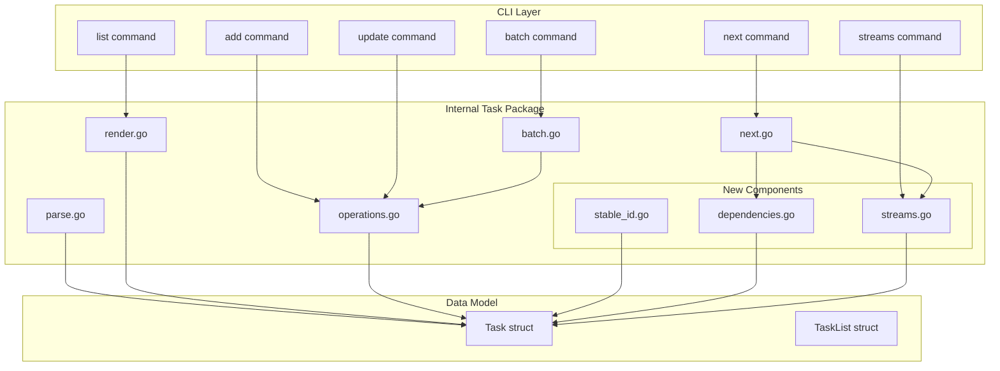
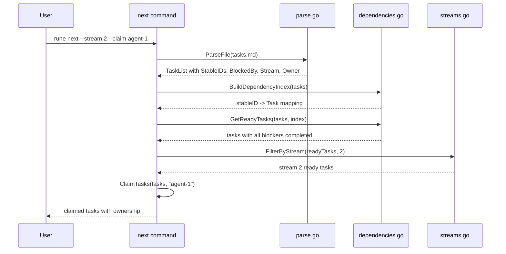

# Design: Task Dependencies and Streams

## Overview

This design document describes the implementation of task dependencies and parallel work streams for rune, enabling multiple agents to work on tasks concurrently. The feature adds four new concepts to the task model:

1. **Stable IDs**: Persistent identifiers stored as HTML comments that survive renumbering
2. **Dependencies (Blocked-by)**: References to tasks that must complete before a task becomes ready
3. **Streams**: Numeric partitions for parallelizing work across agents
4. **Ownership**: Agent identifiers tracking who is working on each task

The implementation follows existing rune patterns for parsing, rendering, and operations while introducing new data structures for dependency graph management.

---

## Architecture

### High-Level Component Diagram



### Data Flow for Dependency Resolution



---

## Components and Interfaces

### 1. Extended Task Struct

**File**: `internal/task/task.go`

```go
// Task represents a single task item with optional dependencies and stream assignment
type Task struct {
    ID           string   `json:"id"`
    Title        string   `json:"title"`
    Status       Status   `json:"status"`
    Details      []string `json:"details,omitempty"`
    References   []string `json:"references,omitempty"`
    Requirements []string `json:"requirements,omitempty"`
    Children     []Task   `json:"children,omitempty"`
    ParentID     string   `json:"parent_id,omitempty"`

    // New fields for dependencies and streams
    StableID  string   `json:"-"`                      // Hidden from JSON output (req 1.5)
    BlockedBy []string `json:"blockedBy,omitempty"`    // Stable IDs of blocking tasks
    Stream    int      `json:"stream,omitempty"`       // Stream assignment (0 = default/1)
    Owner     string   `json:"owner,omitempty"`        // Agent identifier
}
```

**Design Notes**:
- `StableID` uses `json:"-"` tag to exclude from JSON output per requirement 1.5
- `BlockedBy` stores stable IDs internally; custom JSON marshaling translates to hierarchical IDs (see JSON Marshaling section below)
- `Stream` uses `int` where:
  - Value 0 in struct = "not explicitly set" (parsed from file without Stream: line)
  - `GetEffectiveStream()` returns 1 when Stream is 0 (default behavior per req 3.3)
  - Setting Stream to 0 or negative via commands returns `ErrInvalidStream` (req 3.10)
  - JSON output always shows effective stream (1 if not set)
- The `omitempty` tags ensure clean JSON output when fields are not set

**JSON Marshaling for BlockedBy**:

The `BlockedBy` field requires custom marshaling to translate stable IDs to hierarchical IDs for JSON output:

```go
// taskJSON is the JSON representation with translated IDs
type taskJSON struct {
    ID           string     `json:"id"`
    Title        string     `json:"title"`
    Status       string     `json:"status"`
    Details      []string   `json:"details,omitempty"`
    References   []string   `json:"references,omitempty"`
    Requirements []string   `json:"requirements,omitempty"`
    Children     []taskJSON `json:"children,omitempty"`
    BlockedBy    []string   `json:"blockedBy,omitempty"`    // Hierarchical IDs
    Stream       int        `json:"stream,omitempty"`
    Owner        string     `json:"owner,omitempty"`
}

// MarshalTasksJSON converts tasks to JSON with hierarchical BlockedBy IDs
func MarshalTasksJSON(tasks []Task, index *DependencyIndex) ([]byte, error) {
    jsonTasks := make([]taskJSON, len(tasks))
    for i, t := range tasks {
        jsonTasks[i] = toJSONTask(t, index)
    }
    return json.Marshal(jsonTasks)
}

func toJSONTask(t Task, index *DependencyIndex) taskJSON {
    return taskJSON{
        ID:           t.ID,
        Title:        t.Title,
        Status:       t.Status.String(),
        Details:      t.Details,
        References:   t.References,
        Requirements: t.Requirements,
        Children:     toJSONChildren(t.Children, index),
        BlockedBy:    index.TranslateToHierarchical(t.BlockedBy),
        Stream:       GetEffectiveStream(&t),
        Owner:        t.Owner,
    }
}
```

### 2. Stable ID Generator

**File**: `internal/task/stable_id.go`

```go
// StableIDGenerator generates unique stable IDs for tasks
type StableIDGenerator struct {
    usedIDs  map[string]bool
    counter  int64
    randSeed bool // true if seeded from crypto/rand
}

// NewStableIDGenerator creates a generator pre-populated with existing IDs
// Seeds counter from the highest existing ID value to avoid collisions
func NewStableIDGenerator(existingIDs []string) *StableIDGenerator

// Generate creates a new unique 7-character base36 ID
func (g *StableIDGenerator) Generate() string

// IsUsed checks if an ID is already in use
func (g *StableIDGenerator) IsUsed(id string) bool
```

**ID Generation Algorithm**:
1. Initialize counter by finding the maximum numeric value among existing stable IDs (decode from base36)
2. If no existing IDs, seed counter from `crypto/rand` (8 random bytes as int64)
3. Increment counter for each new ID
4. Encode counter as base36 (0-9, a-z)
5. Pad to exactly 7 characters (left-pad with '0')
6. Verify uniqueness against existing IDs map
7. If collision (should be rare), increment counter and retry

```go
// maxBase36_7Chars is the maximum value representable in 7 base36 chars: 36^7 - 1
const maxBase36_7Chars int64 = 78364164095 // "zzzzzzz" in base36

func NewStableIDGenerator(existingIDs []string) *StableIDGenerator {
    g := &StableIDGenerator{
        usedIDs: make(map[string]bool, len(existingIDs)),
    }

    var maxValue int64
    for _, id := range existingIDs {
        g.usedIDs[id] = true
        if val, err := strconv.ParseInt(id, 36, 64); err == nil && val > maxValue {
            maxValue = val
        }
    }

    if maxValue > 0 {
        g.counter = maxValue
    } else {
        // Seed from crypto/rand for first ID in file
        var buf [8]byte
        if _, err := rand.Read(buf[:]); err != nil {
            // Fallback to time-based if crypto/rand fails (shouldn't happen)
            g.counter = time.Now().UnixNano() % maxBase36_7Chars
        } else {
            g.counter = int64(binary.BigEndian.Uint64(buf[:])) % maxBase36_7Chars
        }
        g.randSeed = true
    }

    return g
}

func (g *StableIDGenerator) Generate() (string, error) {
    for attempts := 0; attempts < 1000; attempts++ {
        g.counter++

        // Check for exhaustion (practically impossible with 78 billion IDs)
        if g.counter > maxBase36_7Chars {
            return "", errors.New("stable ID space exhausted (78 billion IDs used)")
        }

        // Convert to base36 and zero-pad to 7 characters
        base36 := strconv.FormatInt(g.counter, 36)
        id := strings.Repeat("0", 7-len(base36)) + base36

        if !g.usedIDs[id] {
            g.usedIDs[id] = true
            return id, nil
        }
    }
    return "", errors.New("failed to generate unique stable ID after 1000 attempts")
}
```

**Rationale**: Base36 with 7 characters provides 78 billion unique IDs, far exceeding any practical task list size. Seeding from existing IDs ensures monotonic growth within a file. Crypto/rand seeding for new files provides unpredictable starting points across different files.

### 3. Dependency Index

**File**: `internal/task/dependencies.go`

```go
// DependencyIndex provides fast lookup for dependency resolution
type DependencyIndex struct {
    byStableID    map[string]*Task  // StableID -> Task lookup
    byHierarchical map[string]*Task // Hierarchical ID -> Task lookup
    dependents    map[string][]string // StableID -> list of tasks that depend on it
}

// BuildDependencyIndex creates an index from a task list
func BuildDependencyIndex(tasks []Task) *DependencyIndex

// GetTask returns a task by stable ID
func (idx *DependencyIndex) GetTask(stableID string) *Task

// GetTaskByHierarchicalID returns a task by hierarchical ID
func (idx *DependencyIndex) GetTaskByHierarchicalID(id string) *Task

// GetDependents returns tasks that depend on the given stable ID
func (idx *DependencyIndex) GetDependents(stableID string) []string

// IsReady returns true if all blockers are completed
func (idx *DependencyIndex) IsReady(task *Task) bool

// IsBlocked returns true if any blocker is not completed
func (idx *DependencyIndex) IsBlocked(task *Task) bool

// DetectCycle checks if adding a dependency would create a cycle
func (idx *DependencyIndex) DetectCycle(fromStableID, toStableID string) (bool, []string)

// TranslateToHierarchical converts stable IDs to current hierarchical IDs
func (idx *DependencyIndex) TranslateToHierarchical(stableIDs []string) []string
```

**Cycle Detection Algorithm**:

The algorithm detects if adding a dependency from task A (fromStableID) to task B (toStableID) would create a cycle. A cycle exists if B transitively depends on A, because adding "A depends on B" would create: A → B → ... → A.

```go
// maxDependencyDepth limits DFS traversal to prevent stack overflow on deep chains
const maxDependencyDepth = 1000

// DetectCycle checks if adding dependency from→to would create a cycle.
// Returns (hasCycle, cyclePath) where cyclePath shows the circular chain.
func (idx *DependencyIndex) DetectCycle(fromStableID, toStableID string) (bool, []string) {
    // Check self-reference: A → A
    if fromStableID == toStableID {
        return true, []string{fromStableID, fromStableID}
    }

    // DFS from the target (toStableID) following its BlockedBy chain.
    // If we can reach the source (fromStableID), adding the dependency
    // would create: fromStableID → toStableID → ... → fromStableID
    visited := make(map[string]bool)
    path := []string{toStableID}

    var dfs func(current string, depth int) bool
    dfs = func(current string, depth int) bool {
        if current == fromStableID {
            return true // Found path back to source - cycle!
        }
        if visited[current] {
            return false // Already explored this branch
        }
        if depth > maxDependencyDepth {
            // Unusually deep chain - log warning but don't treat as cycle
            return false
        }
        visited[current] = true

        task := idx.GetTask(current)
        if task != nil {
            for _, blockerID := range task.BlockedBy {
                path = append(path, blockerID)
                if dfs(blockerID, depth+1) {
                    return true
                }
                path = path[:len(path)-1]
            }
        }
        return false
    }

    if dfs(toStableID, 0) {
        // Return full cycle: from → to → ... → from
        return true, append([]string{fromStableID}, path...)
    }
    return false, nil
}
```

### 4. Stream Management

**File**: `internal/task/streams.go`

```go
// StreamStatus represents the state of a single stream
type StreamStatus struct {
    ID      int      `json:"id"`
    Ready   []string `json:"ready"`   // Hierarchical IDs of ready tasks
    Blocked []string `json:"blocked"` // Hierarchical IDs of blocked tasks
    Active  []string `json:"active"`  // Hierarchical IDs of in-progress tasks
}

// StreamsResult contains status for all streams
type StreamsResult struct {
    Streams   []StreamStatus `json:"streams"`
    Available []int          `json:"available"` // Stream IDs with ready tasks
}

// AnalyzeStreams computes stream status from task list
func AnalyzeStreams(tasks []Task, index *DependencyIndex) *StreamsResult

// FilterByStream returns tasks belonging to the specified stream
func FilterByStream(tasks []Task, stream int) []Task

// GetEffectiveStream returns the stream for a task (1 if not set)
func GetEffectiveStream(task *Task) int
```

**Stream Analysis Algorithm**:
1. Build dependency index
2. Iterate all tasks recursively
3. For each task, determine effective stream (default 1 if not set)
4. Classify task as ready, blocked, or active based on:
   - Active: Status == InProgress
   - Blocked: Any blocker not Completed
   - Ready: All blockers Completed AND Status == Pending AND no Owner
5. Group by stream ID
6. Mark streams with non-empty Ready list as available

**Cross-Stream Dependencies**:
Tasks can depend on tasks in different streams. A task in stream 2 can be blocked by an incomplete task in stream 1. This is expected behavior—dependencies represent logical prerequisites regardless of stream assignment. The stream is purely for work partitioning across agents, not for dependency scoping.

### 5. Extended Parser

**File**: `internal/task/parse.go` (modifications)

**New Regex Patterns**:
```go
// Existing patterns
taskLinePattern        = regexp.MustCompile(`^(\s*)- (\[[ \-xX]\]) (\d+(?:\.\d+)*)\. (.+)$`)
detailLinePattern      = regexp.MustCompile(`^(\s*)- (.+)$`)

// New patterns for stable ID and metadata
stableIDPattern    = regexp.MustCompile(`<!--\s*id:([a-z0-9]{7})\s*-->`)
blockedByPattern   = regexp.MustCompile(`(?i)^blocked-by:\s*(.+)$`)
streamPattern      = regexp.MustCompile(`(?i)^stream:\s*(\d+)$`)
ownerPattern       = regexp.MustCompile(`(?i)^owner:\s*(.+)$`)
blockedByRefPattern = regexp.MustCompile(`([a-z0-9]{7})\s*\([^)]+\)`)
```

**Parsing Flow Modifications**:

1. **Task Line Parsing** (`parseTaskLine`):
   - After extracting title, check for HTML comment with stable ID
   - Extract stable ID if present, strip from title for storage
   - Validate stable ID format (7 lowercase alphanumeric chars)

2. **Metadata Parsing** (`parseDetailsAndChildren`):
   - Check each detail line against new metadata patterns
   - Extract Blocked-by references (parse stable IDs, ignore title hints)
   - Extract Stream value (validate positive integer)
   - Extract Owner value
   - Remaining lines go to Details as before

**Parse-Time Validation**:
- Parsing is lenient: malformed metadata is logged as a warning but parsing continues
- Blocked-by references are stored as-is during parse (stable IDs extracted from format `id (title hint)`)
- Validation of blocked-by targets (do they exist? are they legacy?) happens during operations, not parse
- This allows parsing files that may have stale references (e.g., after manual editing)
- Commands that modify dependencies validate references and return errors for invalid targets
- **Stream: 0 in markdown**: Logged as warning and treated as "not set" (becomes stream 1). This creates a round-trip asymmetry: `Stream: 0` parses as unset, which renders as no Stream line. This is intentional—0 is invalid, and the parser is lenient.
- **Existing cycles not detected on load**: By design, parsing is read-only and doesn't validate dependency graphs. Cycles are only detected when adding/modifying dependencies. A manually-created cycle will manifest as permanently blocked tasks until manually resolved.

**Metadata Order**:
Metadata is rendered in a fixed order for consistency: Details, Blocked-by, Stream, Owner, References, Requirements. This matches the existing pattern for Details/References/Requirements and ensures predictable output. The parser accepts metadata in any order (case-insensitive matching), but rendering always uses the canonical order.

### 6. Extended Renderer

**File**: `internal/task/render.go` (modifications)

**Important**: Rendering is a read-only operation. Stable IDs are generated during write operations (add, batch) in `operations.go`, not during rendering. The renderer only outputs existing stable IDs.

**Markdown Rendering Changes**:
```go
// RenderContext provides dependencies needed for rendering
type RenderContext struct {
    RequirementsFile string
    DependencyIndex  *DependencyIndex // For title hint lookup
}

func renderTask(task *Task, indent string, ctx *RenderContext) string {
    var sb strings.Builder

    // Task line with stable ID (only if already assigned)
    sb.WriteString(fmt.Sprintf("%s- %s %s. %s", indent, task.Status.Checkbox(), task.ID, task.Title))
    if task.StableID != "" {
        sb.WriteString(fmt.Sprintf(" <!-- id:%s -->", task.StableID))
    }
    sb.WriteString("\n")

    childIndent := indent + "  "

    // Render details first
    for _, detail := range task.Details {
        sb.WriteString(fmt.Sprintf("%s- %s\n", childIndent, detail))
    }

    // Render blocked-by with title hints from index
    if len(task.BlockedBy) > 0 {
        refs := formatBlockedByRefs(task.BlockedBy, ctx.DependencyIndex)
        sb.WriteString(fmt.Sprintf("%s- Blocked-by: %s\n", childIndent, refs))
    }

    // Only render Stream if explicitly set (non-zero)
    if task.Stream > 0 {
        sb.WriteString(fmt.Sprintf("%s- Stream: %d\n", childIndent, task.Stream))
    }

    if task.Owner != "" {
        sb.WriteString(fmt.Sprintf("%s- Owner: %s\n", childIndent, task.Owner))
    }

    // ... existing References and Requirements rendering ...

    return sb.String()
}

// formatBlockedByRefs formats stable IDs with current title hints
func formatBlockedByRefs(stableIDs []string, index *DependencyIndex) string {
    refs := make([]string, 0, len(stableIDs))
    for _, id := range stableIDs {
        if index != nil {
            if task := index.GetTask(id); task != nil {
                refs = append(refs, fmt.Sprintf("%s (%s)", id, task.Title))
                continue
            }
        }
        // Fallback: ID only if task not found
        refs = append(refs, id)
    }
    return strings.Join(refs, ", ")
}
```

**JSON Rendering Changes**:
- Include `blockedBy` as hierarchical IDs (translated from stable IDs)
- Include `stream` (effective value, 1 if not set)
- Include `owner` when present
- Never include `stableID` (json:"-" tag handles this)

### 7. Extended Operations

**File**: `internal/task/operations.go` (modifications)

**AddTask Modifications**:
```go
func (tl *TaskList) AddTask(title string, parent string, opts AddOptions) (*Task, error) {
    // ... existing validation ...

    // Generate stable ID for new task
    idGen := NewStableIDGenerator(tl.collectStableIDs())
    stableID := idGen.Generate()

    task := Task{
        Title:    title,
        Status:   Pending,
        StableID: stableID,
        Stream:   opts.Stream,    // New option
        BlockedBy: opts.BlockedBy, // New option (validated stable IDs)
        Owner:    opts.Owner,      // New option
    }

    // ... existing add logic ...
}

type AddOptions struct {
    Position  string
    Phase     string
    Stream    int
    BlockedBy []string // Hierarchical IDs, converted to stable IDs
    Owner     string
}
```

**UpdateTask Modifications**:
```go
func (tl *TaskList) UpdateTask(taskID string, opts UpdateOptions) error {
    task := tl.FindTask(taskID)
    if task == nil {
        return ErrTaskNotFound
    }

    // ... existing updates ...

    if opts.Stream != nil {
        if *opts.Stream < 1 {
            return ErrInvalidStream
        }
        task.Stream = *opts.Stream
    }

    if opts.BlockedBy != nil {
        // Convert hierarchical IDs to stable IDs
        // Validate all targets have stable IDs
        // Check for cycles
        stableIDs, err := tl.resolveToStableIDs(opts.BlockedBy)
        if err != nil {
            return err
        }

        index := BuildDependencyIndex(tl.Tasks)
        if hasCycle, path := index.DetectCycle(task.StableID, stableIDs...); hasCycle {
            return fmt.Errorf("circular dependency detected: %s", strings.Join(path, " -> "))
        }

        task.BlockedBy = stableIDs
    }

    if opts.Owner != nil {
        if err := validateOwner(*opts.Owner); err != nil {
            return err
        }
        task.Owner = *opts.Owner
    }

    if opts.Release {
        task.Owner = ""
    }

    return nil
}
```

**RemoveTask Modifications**:
```go
func (tl *TaskList) RemoveTask(taskID string) ([]string, error) {
    task := tl.FindTask(taskID)
    if task == nil {
        return nil, ErrTaskNotFound
    }

    // Check for dependents
    index := BuildDependencyIndex(tl.Tasks)
    dependents := index.GetDependents(task.StableID)

    warnings := []string{}
    if len(dependents) > 0 {
        // Remove from all blocked-by lists
        tl.removeFromBlockedByLists(task.StableID)
        warnings = append(warnings, fmt.Sprintf(
            "Removed dependency references from %d task(s)", len(dependents)))
    }

    // ... existing remove logic ...

    return warnings, nil
}
```

### 8. Extended Batch Operations

**File**: `internal/task/batch.go` (modifications)

**Extended Operation Struct**:
```go
type Operation struct {
    Type         string   `json:"type"`
    ID           string   `json:"id,omitempty"`
    Parent       string   `json:"parent,omitempty"`
    Title        string   `json:"title,omitempty"`
    Status       *Status  `json:"status,omitempty"`
    Details      []string `json:"details,omitempty"`
    References   []string `json:"references,omitempty"`
    Requirements []string `json:"requirements,omitempty"`
    Position     string   `json:"position,omitempty"`
    Phase        string   `json:"phase,omitempty"`

    // New fields
    Stream    *int     `json:"stream,omitempty"`
    BlockedBy []string `json:"blocked_by,omitempty"` // Hierarchical IDs
    Owner     *string  `json:"owner,omitempty"`
    Release   bool     `json:"release,omitempty"`    // Clear owner
}
```

### 9. Streams Command

**File**: `cmd/streams.go` (new)

```go
var streamsCmd = &cobra.Command{
    Use:   "streams",
    Short: "Display stream status",
    Long:  "Shows the status of all work streams including ready, blocked, and active task counts",
    RunE:  runStreams,
}

func init() {
    rootCmd.AddCommand(streamsCmd)
    streamsCmd.Flags().BoolP("available", "a", false, "Show only available streams")
    streamsCmd.Flags().BoolP("json", "j", false, "Output as JSON")
}

func runStreams(cmd *cobra.Command, args []string) error {
    tl, err := task.ParseFile(getFilePath())
    if err != nil {
        return err
    }

    index := task.BuildDependencyIndex(tl.Tasks)
    result := task.AnalyzeStreams(tl.Tasks, index)

    if available, _ := cmd.Flags().GetBool("available"); available {
        result = filterAvailableStreams(result)
    }

    if jsonFlag, _ := cmd.Flags().GetBool("json"); jsonFlag {
        return outputJSON(result)
    }

    return outputTable(result)
}
```

### 10. Enhanced Next Command

**File**: `cmd/next.go` (modifications)

```go
func init() {
    // ... existing flags ...
    nextCmd.Flags().IntP("stream", "s", 0, "Filter to specific stream")
    nextCmd.Flags().StringP("claim", "c", "", "Claim task(s) with agent ID")
}

func runNext(cmd *cobra.Command, args []string) error {
    tl, err := task.ParseFile(getFilePath())
    if err != nil {
        return err
    }

    streamFlag, _ := cmd.Flags().GetInt("stream")
    claimFlag, _ := cmd.Flags().GetString("claim")
    phaseFlag, _ := cmd.Flags().GetBool("phase")

    index := task.BuildDependencyIndex(tl.Tasks)

    if phaseFlag {
        return handlePhaseMode(tl, index, streamFlag, claimFlag)
    }

    // Find ready tasks
    readyTasks := task.GetReadyTasks(tl.Tasks, index)

    if streamFlag > 0 {
        readyTasks = task.FilterByStream(readyTasks, streamFlag)
    }

    if claimFlag != "" {
        if streamFlag > 0 {
            // Claim all ready tasks in stream
            return claimStreamTasks(tl, readyTasks, claimFlag)
        } else {
            // Claim single next task
            if len(readyTasks) > 0 {
                return claimSingleTask(tl, readyTasks[0], claimFlag)
            }
        }
    }

    // ... existing output logic ...
}
```

---

## Data Models

### Markdown Storage Format

```markdown
## Phase 1: Setup

- [ ] 1. Initialize project <!-- id:abc1234 -->
  - Details about initialization
  - Stream: 1

- [ ] 2. Configure database <!-- id:def5678 -->
  - Blocked-by: abc1234 (Initialize project)
  - Stream: 1

## Phase 2: Implementation

- [ ] 3. Build API <!-- id:ghi9012 -->
  - Blocked-by: def5678 (Configure database)
  - Stream: 1
  - Owner: agent-backend

- [ ] 4. Build UI <!-- id:jkl3456 -->
  - Blocked-by: abc1234 (Initialize project)
  - Stream: 2
```

### JSON Output Format

**List Command**:
```json
{
  "success": true,
  "count": 4,
  "tasks": [
    {
      "id": "1",
      "title": "Initialize project",
      "status": "Pending",
      "stream": 1,
      "blockedBy": [],
      "owner": ""
    },
    {
      "id": "2",
      "title": "Configure database",
      "status": "Pending",
      "stream": 1,
      "blockedBy": ["1"],
      "owner": ""
    }
  ]
}
```

**Streams Command**:
```json
{
  "streams": [
    {
      "id": 1,
      "ready": ["1"],
      "blocked": ["2", "3"],
      "active": []
    },
    {
      "id": 2,
      "ready": [],
      "blocked": ["4"],
      "active": []
    }
  ],
  "available": [1]
}
```

**Next Command with Claim**:
```json
{
  "claimed": [
    {
      "id": "1",
      "title": "Initialize project",
      "status": "InProgress",
      "stream": 1,
      "owner": "agent-1"
    }
  ],
  "remaining": [
    {
      "id": "2",
      "title": "Configure database",
      "blockedBy": ["1"]
    }
  ]
}
```

---

## Error Handling

### Error Types

```go
var (
    // Stable ID errors
    ErrNoStableID       = errors.New("task does not have a stable ID (legacy task)")
    ErrStableIDNotFound = errors.New("stable ID not found")
    ErrDuplicateStableID = errors.New("duplicate stable ID detected")

    // Dependency errors
    // Note: Self-reference is a special case of circular dependency.
    // Both return ErrCircularDependency for consistency, with different messages.
    ErrCircularDependency = errors.New("circular dependency detected")
    ErrInvalidBlockedBy   = errors.New("invalid blocked-by reference")

    // Stream errors
    ErrInvalidStream = errors.New("stream must be a positive integer")

    // Owner errors
    ErrInvalidOwner = errors.New("owner contains invalid characters")
)

// CircularDependencyError provides detailed cycle information
type CircularDependencyError struct {
    Path []string // Cycle path: [A, B, C, A] for A→B→C→A
}

func (e *CircularDependencyError) Error() string {
    if len(e.Path) == 2 && e.Path[0] == e.Path[1] {
        return fmt.Sprintf("task cannot depend on itself: %s", e.Path[0])
    }
    return fmt.Sprintf("circular dependency detected: %s", strings.Join(e.Path, " → "))
}
```

### Error Scenarios and Handling

| Scenario | Error | Behavior |
|----------|-------|----------|
| Add dependency to legacy task | `ErrNoStableID` | Return error, explain limitation |
| Circular dependency detected | `CircularDependencyError` | Return error with cycle path |
| Self-reference dependency | `CircularDependencyError` | Return error (special message) |
| Invalid stable ID in blocked-by | Warning | Ignore invalid reference, continue |
| Deleted task has dependents | Warning | Remove references, proceed with deletion |
| Stream value 0 or negative | `ErrInvalidStream` | Return error |
| Owner with newlines | `ErrInvalidOwner` | Return error |
| Claim already-claimed task | Skip | Task excluded from claim results |
| No ready tasks for claim | Success | Return empty claimed list, exit 0 |

### Warning Mechanism

Warnings are non-fatal issues that should be surfaced to users without stopping execution.

```go
// Warning represents a non-fatal issue encountered during operation
type Warning struct {
    Code    string `json:"code"`
    Message string `json:"message"`
    TaskID  string `json:"taskId,omitempty"` // Hierarchical ID if applicable
}

// Common warning codes
const (
    WarnInvalidStableID    = "invalid_stable_id"
    WarnMissingDependency  = "missing_dependency"
    WarnDuplicateStableID  = "duplicate_stable_id"
    WarnInvalidStreamValue = "invalid_stream_value"
    WarnDependentsRemoved  = "dependents_removed"
)
```

**Warning Output**:
- **CLI (table/markdown format)**: Write warnings to stderr, one per line with "Warning: " prefix
- **JSON format**: Include in result object as `"warnings": []` array

```go
type OperationResult struct {
    Success  bool      `json:"success"`
    Warnings []Warning `json:"warnings,omitempty"`
    // ... other fields
}

// Example stderr output:
// Warning: invalid stable ID format 'ABC123!' in task 2.1, ignoring
// Warning: blocked-by reference 'xyz1234' not found, ignoring
```

### Warning Output Format

```go
type OperationResult struct {
    Success  bool     `json:"success"`
    Warnings []string `json:"warnings,omitempty"`
    // ... other fields
}
```

---

## Testing Strategy

### Unit Tests

**1. Stable ID Generation** (`stable_id_test.go`)
- Test uniqueness across 10,000 generations
- Test base36 encoding correctness
- Test 7-character length constraint
- Test collision detection with existing IDs

**2. Dependency Index** (`dependencies_test.go`)
- Test index building from task hierarchy
- Test `IsReady` with various blocker states
- Test `IsBlocked` with partial completion
- Test cycle detection:
  - Self-reference (A → A)
  - Direct cycle (A → B → A)
  - Indirect cycle (A → B → C → A)
  - No cycle (valid chain)
- Test `TranslateToHierarchical` accuracy

**3. Stream Analysis** (`streams_test.go`)
- Test stream derivation from tasks
- Test ready/blocked/active classification
- Test default stream (1) assignment
- Test `FilterByStream` correctness
- Test available stream calculation

**4. Parsing** (`parse_test.go` additions)
- Test stable ID extraction from HTML comments
- Test Blocked-by parsing with title hints
- Test case-insensitive metadata parsing
- Test Stream value parsing and validation
- Test Owner parsing
- Test round-trip (parse → render → parse)
- Test legacy files without new fields

**Negative parsing tests** (malformed input):
- Invalid stable ID format (wrong length, uppercase, special chars)
- Stable ID comment without proper spacing
- Blocked-by with malformed stable ID references
- Stream with non-integer value (logs warning, ignores line)
- Stream with zero or negative value (logs warning, ignores line)
- Duplicate stable IDs in same file (logs warning on second occurrence)
- Blocked-by reference to non-existent stable ID (logs warning, keeps reference for later validation)

**5. Rendering** (`render_test.go` additions)
- Test stable ID inclusion in markdown
- Test Blocked-by formatting with title hints
- Test Stream rendering
- Test Owner rendering
- Test metadata order preservation
- Test JSON output excludes stable IDs

**6. Operations** (`operations_test.go` additions)
- Test AddTask with stable ID generation
- Test AddTask with stream/blocked-by/owner
- Test UpdateTask with dependency validation
- Test UpdateTask with cycle detection
- Test RemoveTask with dependent cleanup
- Test `--release` flag clears owner

### Integration Tests

**1. Multi-Agent Workflow** (`integration_test.go`)
```go
func TestMultiAgentWorkflow(t *testing.T) {
    // Setup: Create task file with streams
    // Agent 1: Claim stream 1
    // Agent 2: Claim stream 2
    // Agent 1: Complete task, verify blocked tasks unblocked
    // Agent 2: Get newly available tasks
    // Verify: No duplicate claims, correct state
}
```

**2. Dependency Chain Resolution**
```go
func TestDependencyChainResolution(t *testing.T) {
    // Setup: A → B → C → D chain
    // Verify: Only A is ready
    // Complete A, verify B ready
    // Complete B, verify C ready
    // Continue until D complete
}
```

**3. Backward Compatibility**
```go
func TestLegacyFileCompatibility(t *testing.T) {
    // Parse existing file without new fields
    // Verify all operations work
    // Add new task with stable ID
    // Verify mixed legacy/new tasks work
}
```

### Property-Based Testing

The following requirements express universal guarantees suitable for property-based testing:

**1. Stable ID Uniqueness (req 1.7)**
```go
// Property: All stable IDs in a task list are unique
func TestProperty_StableIDUniqueness(t *testing.T) {
    rapid.Check(t, func(t *rapid.T) {
        tasks := generateRandomTaskList(t)
        ids := collectStableIDs(tasks)
        assert.Equal(t, len(ids), len(uniqueSet(ids)))
    })
}
```

**2. Parse-Render Round-Trip (req 7.4)**
```go
// Property: parse(render(tasks)) == tasks for all valid task lists
func TestProperty_RoundTrip(t *testing.T) {
    rapid.Check(t, func(t *rapid.T) {
        original := generateRandomTaskList(t)
        rendered := RenderMarkdown(original)
        parsed, _ := ParseMarkdown(rendered)
        assert.DeepEqual(t, original.Tasks, parsed.Tasks)
    })
}
```

**3. Cycle Detection Correctness (req 2.14-2.16)**
```go
// Property: No cycle can be created through dependency operations
func TestProperty_NoCyclesCreated(t *testing.T) {
    rapid.Check(t, func(t *rapid.T) {
        tasks := generateRandomTaskList(t)
        from := pickRandomTask(t, tasks)
        to := pickRandomTask(t, tasks)

        err := addDependency(tasks, from.ID, to.ID)
        if err == nil {
            // Verify no cycle exists
            assert.False(t, hasCycle(tasks))
        }
    })
}
```

**Framework**: Use `github.com/flyingmutant/rapid` for Go property-based testing.

---

## Requirements Traceability

| Requirement | Design Element |
|-------------|----------------|
| 1.1-1.4 | StableIDGenerator, base36 encoding, 7-char length |
| 1.5 | Task.StableID with `json:"-"` tag |
| 1.6-1.8 | StableIDGenerator.IsUsed, operations preserve IDs |
| 1.9-1.10 | ErrNoStableID, legacy task handling |
| 2.1-2.3 | Task.BlockedBy, blockedByPattern regex |
| 2.4-2.5 | DependencyIndex.IsReady, IsBlocked |
| 2.6 | DependencyIndex.TranslateToHierarchical |
| 2.7 | RemoveTask warnings, removeFromBlockedByLists |
| 2.8-2.10 | UpdateOptions.BlockedBy, AddOptions.BlockedBy, Operation.BlockedBy |
| 2.11 | Warning on invalid stable ID, ignore reference |
| 2.12 | ErrNoStableID when target is legacy |
| 2.13 | formatBlockedByRefs uses current title, stored hints not updated |
| 2.14-2.16 | DependencyIndex.DetectCycle, ErrCircularDependency, ErrSelfReference |
| 3.1-3.2 | Task.Stream int field, streamPattern regex |
| 3.3 | GetEffectiveStream returns 1 if not set |
| 3.4 | AnalyzeStreams derives from task assignments |
| 3.5 | StreamStatus.Available calculation |
| 3.6-3.9 | Rendering, UpdateOptions.Stream, AddOptions.Stream, Operation.Stream |
| 3.10 | ErrInvalidStream validation |
| 4.1-4.3 | Task.Owner field, ownerPattern regex, rendering |
| 4.4-4.5 | UpdateOptions.Owner, UpdateOptions.Release |
| 4.6 | list --owner flag filtering |
| 4.7-4.9 | Operation.Owner, validateOwner |
| 5.1-5.6 | streams command, StreamsResult, StreamStatus |
| 6.1-6.13 | next command enhancements, claimStreamTasks, claimSingleTask |
| 7.1-7.7 | Parser/renderer modifications, stableIDPattern, metadata patterns |
| 8.1-8.5 | list command enhancements, JSON output changes |
| 9.1-9.6 | Legacy task handling, read-only parse, backward compatibility |

---

## Implementation Notes

### File Organization

New files to create:
- `internal/task/stable_id.go` - Stable ID generation
- `internal/task/dependencies.go` - Dependency index and resolution
- `internal/task/streams.go` - Stream analysis
- `cmd/streams.go` - Streams command

Files to modify:
- `internal/task/task.go` - Extended Task struct
- `internal/task/parse.go` - New regex patterns, metadata parsing
- `internal/task/render.go` - Stable ID and metadata rendering
- `internal/task/operations.go` - Extended add/update/remove
- `internal/task/batch.go` - Extended Operation struct
- `cmd/next.go` - Stream and claim flags
- `cmd/list.go` - Stream/owner display and filtering
- `cmd/add.go` - New flags
- `cmd/update.go` - New flags

### Backward Compatibility Considerations

1. **Parse without modification**: Read operations never write stable IDs to disk
2. **Legacy tasks work**: All existing operations continue functioning
3. **Gradual migration**: New tasks get stable IDs, old tasks remain legacy
4. **Clear error messages**: When legacy limitations are hit, explain why

### Documentation Updates

The following documentation must be updated to cover the new functionality:

**1. README.md** (root)
- Add section on task dependencies and how to use blocked-by
- Add section on work streams for parallel agent execution
- Add section on the new `streams` command
- Update `next` command documentation with `--stream` and `--claim` flags

**2. docs/AGENT_INSTRUCTIONS.md**
- Add "Multi-Agent Parallel Execution" section covering:
  - Setting up streams for work partitioning
  - Using `rune next --stream N --claim AGENT_ID` for stream claiming
  - Using `rune next --claim AGENT_ID` for single-task claiming
  - Checking stream status with `rune streams`
- Add "Task Dependencies" section covering:
  - Adding dependencies with `--blocked-by`
  - Understanding ready vs blocked tasks
  - Dependency resolution workflow
- Update batch operation examples with new fields

**3. docs/json-api.md**
- Add new fields to Operation schema:
  - `stream` (integer, optional)
  - `blocked_by` (array of strings, optional)
  - `owner` (string, optional)
  - `release` (boolean, optional)
- Add new fields to Task schema:
  - `blockedBy` (array of strings)
  - `stream` (integer)
  - `owner` (string)
- Add StreamsResult and StreamStatus schemas
- Add ClaimResult schema for next --claim output
- Add Warning schema for warning mechanism

**4. Command Help Text** (Long descriptions in cmd/*.go)
- `cmd/next.go`: Document `--stream`, `--claim` flags and behavior
- `cmd/list.go`: Document `--stream`, `--owner` filter flags
- `cmd/add.go`: Document `--stream`, `--blocked-by`, `--owner` flags
- `cmd/update.go`: Document `--stream`, `--blocked-by`, `--owner`, `--release` flags
- `cmd/streams.go`: Full documentation for new streams command

**5. docs/CREATE_TASKS.md** (if exists)
- Update with dependency and stream examples

**6. Example files** (examples/ directory)
- Add `examples/parallel-agents.md` demonstrating streams and dependencies
- Update existing examples if they would benefit from showing new features

### Performance Considerations

1. **Dependency index**: Built once per command invocation, O(n) where n = total tasks
2. **Cycle detection**: O(n) worst case for deep chains, typically much faster
3. **Stream analysis**: O(n) single pass through all tasks
4. **No caching**: Index rebuilt per command (simplicity over optimization)

**Documented Performance Limits**:
- The index rebuild approach is acceptable for task files up to ~10,000 tasks
- For a file with 1,000 tasks, typical command execution is 10-50ms (including file I/O, parsing, and index building)
- This matches rune's existing file size limit (10MB) and practical usage patterns
- If performance becomes an issue with very large files, caching can be added later as an optimization (not in initial scope)

**Rationale for rebuild-per-command**:
- Simplicity: No cache invalidation logic needed
- Correctness: Always reflects current file state
- CLI usage pattern: Commands are infrequent, not high-throughput operations
- File-based: No persistent process to maintain cached state
