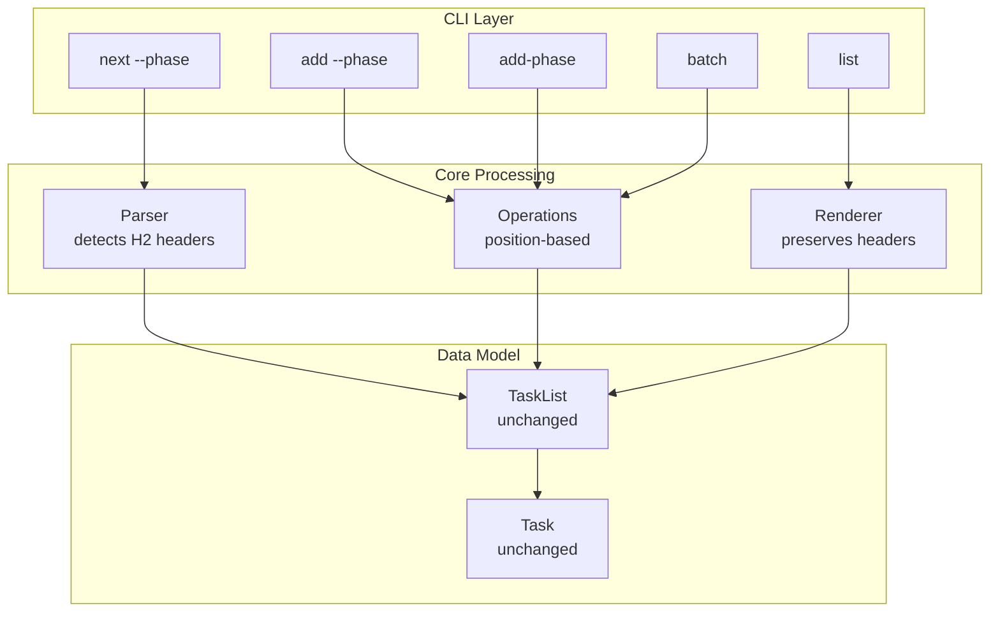

# Task Phases Feature Design

## Overview

The task phases feature introduces a lightweight organization mechanism for visually grouping related tasks under semantic section headers. Phases are purely positional markers that provide logical grouping without affecting the core task model. The implementation treats markdown H2 headers (`## Phase Name`) as phase boundaries while preserving the existing sequential task numbering system across the entire document.

### Key Design Principles

1. **Position-Based Association**: Phase membership determined solely by document position
2. **No Model Changes**: Tasks remain unchanged; phases are a rendering concern
3. **Sequential Numbering**: Task IDs remain sequential across all phases (1, 2, 3...)
4. **Document Preservation**: Phase headers maintain their position during all operations
5. **Simplicity First**: Phases are visual indicators, not structural elements

## Architecture

### Simplified Architecture



### Data Flow

1. **Parsing**: Parser notes H2 headers positions but doesn't store them in the model
2. **Operations**: When `--phase` is used, scan document to find/create phase position
3. **Rendering**: Reconstruct document preserving H2 headers at their positions
4. **Persistence**: Phase headers are just markdown text, naturally preserved

## Components and Interfaces

### Core Data Structures

```go
// PhaseMarker represents a phase header found during parsing
// This is a transient structure used only during parsing/rendering
type PhaseMarker struct {
    Name         string // Phase name from H2 header
    AfterTaskID  string // ID of task that precedes this phase (empty if at start)
}

// TaskList remains unchanged - no new fields needed
type TaskList struct {
    Title       string
    Tasks       []Task
    FrontMatter *FrontMatter
    FilePath    string
    Modified    time.Time
    // Note: Phase markers are extracted during parsing but not stored
}

// Task struct remains completely unchanged
type Task struct {
    ID         string
    Title      string
    Status     Status
    Details    []string
    References []string
    Children   []Task
    ParentID   string
    // No phase field - phase is determined by position
}
```

### Key Functions

```go
// Phase detection during parsing (in parse.go)
func extractPhaseMarkers(lines []string) []PhaseMarker {
    // Scan for H2 headers and record their positions
    // Returns ordered list of phase markers
}

// Phase-aware rendering (in render.go)
func renderWithPhases(tl *TaskList, markers []PhaseMarker) []byte {
    // Reconstruct document with phase headers at correct positions
}

// Phase operations (in phase.go)
func addPhase(name string) string {
    // Returns markdown line for new phase header
    return fmt.Sprintf("## %s\n", name)
}

// Finding phase for a task (positional)
func getTaskPhase(taskID string, content []byte) string {
    // Parse content to find which phase contains this task
    // Returns empty string if not in any phase
}

// Get tasks for next phase
func getNextPhaseTasks(content []byte) ([]Task, string) {
    // Find first phase with pending tasks
    // Return tasks and phase name
}
```

### Command Extensions

```go
// add command - extend with --phase flag
addCmd.Flags().StringVar(&phaseFlag, "phase", "", "target phase for the new task")

// next command - extend with --phase flag
nextCmd.Flags().BoolVar(&phaseFlag, "phase", false, "get all tasks from next phase")

// New add-phase command
var addPhaseCmd = &cobra.Command{
    Use:   "add-phase [name]",
    Short: "Add a new phase to the task file",
    RunE:  runAddPhase,
}
```

## Data Models

### Phase Detection During Parsing

Phases are detected transiently during parsing:

1. **Detection**: Lines matching `^## (.+)$` are identified as phase markers
2. **Extraction**: Phase markers are collected with their relative positions
3. **Association**: Tasks are implicitly associated by position (not stored)
4. **Preservation**: Phase markers are maintained during rendering

### Task-Phase Association Rules

1. Tasks belong to the most recent phase header that precedes them in the document
2. Tasks before any phase header have no phase association (empty string)
3. Phase names are case-sensitive and preserved exactly as entered
4. Duplicate phase names are allowed (each is independent)

### ID Management with Phases

Task IDs remain sequential across the entire document:
- Phase 1: Tasks 1, 2, 3
- Phase 2: Tasks 4, 5
- Phase 3: Tasks 6, 7, 8

When tasks are added or removed, all subsequent task IDs are renumbered regardless of phase boundaries. Manual phase reordering in the markdown is out of scope - the system assumes phases remain in their positions.

## Error Handling

### Phase-specific Error Scenarios

1. **Non-existent Phase in --phase Flag**
   - Behavior: Create phase header and append at end of document
   - New phase is added after all existing content
   - Tasks added to the new phase immediately follow the header

2. **Duplicate Phase Names**
   - Behavior: First occurrence is used for `--phase` operations
   - Each phase header is independent in the document

3. **Empty Phase Creation**
   - Behavior: Phase headers can exist without tasks
   - Empty phases are preserved during all operations

4. **Phase Name Validation**
   - Any text after `## ` becomes the phase name
   - No character restrictions or validation

### Backward Compatibility

1. **Documents Without Phases**
   - All operations continue to work identically
   - No phase column shown in table output
   - No phase field in JSON output

2. **Mixed Content**
   - Tasks can exist both inside and outside phases
   - Non-phased tasks appear with empty phase in table output

## Testing Strategy

### Unit Tests

1. **Parser Tests** (`parse_test.go`)
   - Test phase detection with various H2 formats
   - Test mixed content (phases and non-phased tasks)
   - Test task association with correct phases
   - Test preservation of phase headers during parsing

2. **Operations Tests** (`operations_test.go`, `phase_test.go`)
   - Test adding tasks to specific phases
   - Test phase auto-creation behavior
   - Test ID renumbering across phase boundaries
   - Test operations on duplicate phase names

3. **Renderer Tests** (`render_test.go`)
   - Test phase preservation in markdown output
   - Test phase column in table output
   - Test JSON output with phase information
   - Test conditional phase column display

4. **Command Tests** (`add_test.go`, `next_test.go`, `add_phase_test.go`)
   - Test --phase flag behavior
   - Test next --phase command logic
   - Test add-phase command
   - Test batch operations with phases

### Integration Tests

1. **End-to-end Workflows** (`integration_test.go`)
   - Create document with phases, add tasks, verify structure
   - Test round-trip (parse -> modify -> render -> parse)
   - Test git discovery with phase-organized files
   - Test batch operations creating and populating phases

2. **Backward Compatibility Tests**
   - Verify existing test files work unchanged
   - Test mixed documents with partial phase adoption
   - Verify no performance degradation

### Test Data Structure

```
examples/
  phases/
    simple_phases.md       # Basic phase structure
    mixed_content.md       # Phases and non-phased tasks
    empty_phases.md        # Phases without tasks
    duplicate_phases.md    # Same phase name multiple times
  compatibility/
    legacy_tasks.md        # Existing format without phases
```

## Implementation Plan

### Phase 1: Parser and Renderer Updates
- Modify parser to recognize H2 headers but not store them
- Update renderer to preserve H2 headers during output
- Ensure round-trip preservation (parse → render → parse)

### Phase 2: Basic Phase Operations  
- Implement `add-phase` command to append phase headers
- Add `--phase` flag to `add` command
- Implement phase detection logic for positional operations

### Phase 3: Display and Query Support
- Add conditional phase column to table output
- Implement `next --phase` to get tasks from next phase
- Update JSON output to include phase information when present

### Phase 4: Batch and Testing
- Add phase support to batch operations
- Comprehensive unit and integration tests
- Update documentation and examples

## Decision Rationale

### Why Position-Based Phase Association?

Storing phases only by position rather than in the data model:
1. **Simplicity**: No model changes required, phases are just visual markers
2. **No Redundancy**: Single source of truth - the document itself
3. **Natural Preservation**: Phase headers are just markdown text
4. **No Synchronization**: Nothing to keep in sync during operations
5. **True Backward Compatibility**: Zero impact on existing code paths

### Why H2 Headers for Phases?

H2 headers (`## Phase Name`) were chosen because:
1. Standard markdown format that renders well everywhere
2. Visually distinct from task items
3. Simple regex pattern: `^## (.+)$`
4. Allows H1 for document title
5. Natural document structure

### Why Append Auto-Created Phases?

Appending new phases at document end:
1. Predictable behavior - users know where phases go
2. Preserves existing document structure
3. Simple implementation - no complex insertion logic
4. Avoids disrupting task numbering mid-document
5. Users can manually reorder if needed